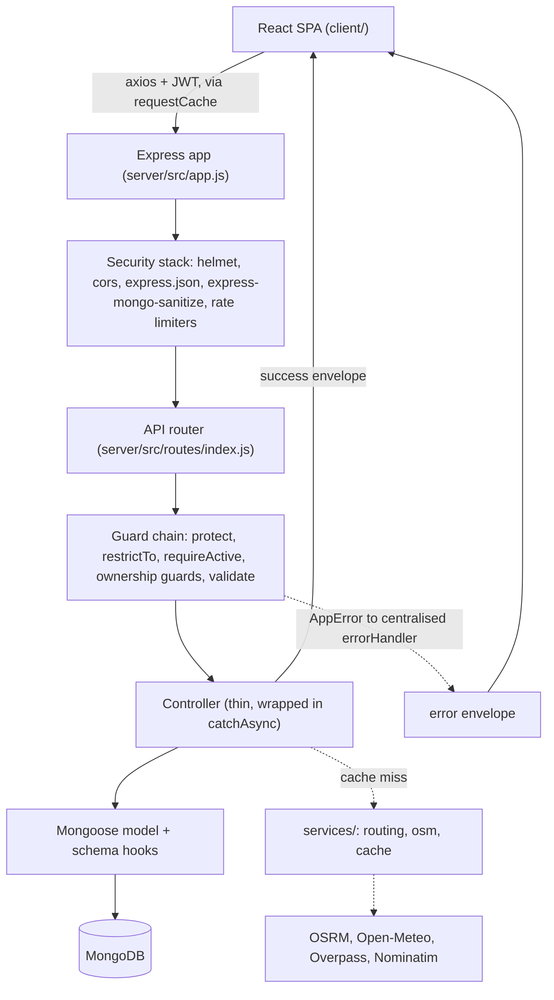
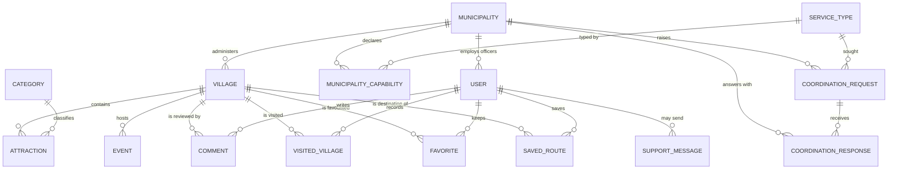

# Mountain-Able — Full Project Report

### A Digital Platform for Enhancing Tourism in Italian Mountain Villages, and for Coordination Between the Municipalities That Maintain It

**Master's project — Politecnico di Milano**
Master *"Mountain-Able"* (Programming and Planning for Sustainable Mountain Development), 2025/2026
Supervisor: Prof. Corradi

*Compiled 20 September 2026. This document supersedes `docs/project-report.md`, which it incorporates and extends.*

---

## A note on evidence

Every claim in this report is traceable to source code in this repository, to a
document within it, or to a measurement that can be reproduced against the running
system. Figures describing the dataset refer to what `npm run seed` produces, not
to whatever state a development database happens to be in.

Where something could not be established by reading the repository it is marked
**[unverified]**. Where a feature was planned and not built, this report says so.

---

## Table of contents

1. [Introduction](#1-introduction)
2. [Problem analysis](#2-problem-analysis)
3. [System overview](#3-system-overview)
4. [Actors and roles](#4-actors-and-roles)
   - 4.1 [Tourist](#41-tourist) · 4.2 [Municipality officer](#42-municipality-officer) · 4.3 [System administrator](#43-system-administrator) · 4.4 [Regional authority](#44-regional-authority) · 4.5 [Actor–entity interaction matrix](#45-actorentity-interaction-matrix)
5. [System architecture](#5-system-architecture)
6. [Data model](#6-data-model)
7. [Features in detail](#7-features-in-detail)
8. [Security](#8-security)
9. [Frontend implementation](#9-frontend-implementation)
10. [Problems encountered and how they were resolved](#10-problems-encountered-and-how-they-were-resolved)
11. [Testing and verification](#11-testing-and-verification)
12. [Current limitations and future work](#12-current-limitations-and-future-work)
13. [Ethical and sustainability considerations](#13-ethical-and-sustainability-considerations)
14. [Conclusion](#14-conclusion)

---

## 1. Introduction

### 1.1 Context

Italy's tourism economy is heavily concentrated in a small number of well-known
destinations. Rome, Florence, Venice and Milan, together with a handful of coastal
and lake resorts, absorb a disproportionate share of both domestic and
international visitors. Beyond these hubs lies a vast and largely overlooked
territory: the mountain villages of the Alps and the Apennines. These settlements
hold centuries of cultural heritage, distinctive craft and food traditions, and
landscapes of considerable natural value, yet they remain almost invisible in the
channels through which most travellers plan their journeys.

The consequences of this imbalance are well documented and mutually reinforcing.
Concentrated tourism produces congestion, rising living costs and cultural erosion
in the major destinations, while the mountain interior suffers the opposite
problem: economic marginalisation, ageing populations and progressive
depopulation. As younger residents leave in search of opportunity, the local
economy contracts, services close, and the villages become still harder to
discover — a feedback loop that accelerates decline.

### 1.2 What this project claims, and what it does not

The Mountain-Able platform addresses one specific, tractable link in this chain:
**visibility and trustworthy information**. It does not attempt to solve
depopulation, and it should not be read as claiming to. Depopulation is a
structural economic and demographic problem requiring policy instruments far
beyond the reach of a software platform. What a platform *can* do is remove one
concrete obstacle — that a traveller who might have visited a mountain village
cannot find reliable information about it, and that the municipality which holds
that information has no effective channel for publishing it.

This framing is deliberate and is maintained throughout the document. A system
that claimed more would be easier to present and harder to defend.

### 1.3 Objectives

- Provide a **centralised repository** of tourism information for Italian mountain
  villages, maintained by the municipalities themselves.
- Make these villages **discoverable** through search, filtering, an interactive
  map and journey planning.
- Build **trust** through community reviews subject to administrative moderation.
- Give regional authorities an **aggregated, evidence-based view** of engagement
  across their territory.
- Enable **coordination between municipalities**: let each comune declare the
  services it can offer a neighbour, and ask a neighbour for one it lacks.
- Do all of this within a **clearly bounded scope**, excluding features (booking,
  payments, transport optimisation) that would compromise the platform's
  neutrality or exceed the resources of a Master's project.

The fifth objective deserves emphasis because it was the last to be built and is
the one that most directly addresses the original proposal's stated aims of
*enhancing data sharing between local authorities* and *improving coordination
between municipalities*. Until it existed, the platform satisfied those aims only
in the weak sense that several municipalities published into the same database.

---

## 2. Problem analysis

Framed technically, the underlying problem is one of **data fragmentation and
absent infrastructure**.

### 2.1 Conditions

- **No centralised database exists.** Information about mountain villages is
  scattered across a heterogeneous collection of sources: individual municipal
  websites (often outdated and rarely mobile-friendly), downloadable PDF
  brochures, regional tourism portals with uneven coverage, and social-media pages
  maintained irregularly by volunteers or local associations.
- **Formats are inconsistent across municipalities.** Two neighbouring comuni may
  describe comparable attractions using entirely different structures,
  vocabularies and levels of detail. There is no shared schema, so the data cannot
  be aggregated, compared or searched uniformly.
- **Small administrations lack technical capacity.** A village of a few hundred
  residents does not employ web developers or content strategists. Where a website
  exists at all, it is frequently the product of a one-off contract that has since
  lapsed, leaving content frozen at the moment the contract ended.
- **Capacity is fragmented across administrative boundaries.** A comune of three
  hundred residents cannot justify a shuttle service, an equipment rental point or
  a licensed mountain guide. The village twelve kilometres down the valley may
  already operate one. Neither has any channel through which to discover the
  other.

### 2.2 Consequences

Travellers cannot reliably find or compare mountain villages, so they default to
destinations that are already well served online. The absence of a feedback
channel means municipalities receive no structured signal about what visitors
value. Regional bodies responsible for territorial development have no consolidated
dataset from which to reason about where engagement is growing or lagging, or about
which services their territory persistently lacks.

### 2.3 The resulting need

A **shared platform with a common data model, a low technical barrier to entry for
municipalities, a moderation layer that keeps the aggregated information
trustworthy, and a channel between neighbouring administrations**. This is
precisely the scope Mountain-Able implements: a common `Village` schema every
municipality populates through the same interface; an officer role that requires no
technical skill beyond filling in a web form; an administrative role that validates
content and moderates community contributions; and a capability registry through
which municipalities can find and ask one another.

---

## 3. System overview

### 3.1 Composition

Mountain-Able is a full-stack web application composed of two deployable units held
in one repository:

- a **REST API** (`server/`) built with Node.js, Express and MongoDB via Mongoose,
  using JSON Web Tokens for authentication — 15 router modules defining 92 route
  handlers over 16 collections; and
- a **single-page frontend** (`client/`) built with React 18, Vite and Tailwind
  CSS — 40 page components, with all user-facing text routed through i18next
  across 796 translation keys in each of English and Italian.

### 3.2 The two purposes

The platform serves two distinct value chains, and it is worth separating them
because the second was the last to be built and is the less obvious one.

**Tourism.** *Officers produce content → administrators validate it → tourists
consume it and generate feedback → authorities aggregate that feedback into
territorial insight.* Sections 4 and 7.1–7.5 develop this chain.

**Coordination.** *Each municipality declares the services it can offer → its
neighbours can see them → a municipality that cannot meet a visitor need asks the
valley → the record of what was asked and whether it was met becomes territorial
evidence.* Section 7.6 develops this chain.

The first runs from municipalities outward to visitors. The second runs *between*
municipalities. Everything else in the platform helps a comune speak to tourists;
coordination is the only part that helps comuni speak to each other, and it
addresses the fragmentation identified in §2.1 rather than merely the visibility
problem.

### 3.3 Roles

Four user groups, modelled as a role on the `User` document (`ROLES = ['tourist',
'officer', 'admin', 'authority']` in `server/src/models/User.js`):

| Role | Purpose |
|---|---|
| `tourist` | Discovers villages, searches and filters them, plans journeys, contributes reviews, tracks personal visits and favourites |
| `officer` | Creates and maintains the villages, attractions and events of their own municipality; declares coordination capabilities; raises and answers coordination requests |
| `admin` | Validates and publishes content, moderates reviews, manages users and taxonomies, approves officer accounts |
| `authority` | Consumes aggregated statistics, strictly read-only |

### 3.4 Scope boundary

The following are explicitly **excluded** and documented as future work: online
booking, payments, transport optimisation, real-time emergency services, and
AI-based chatbots or recommendations. This exclusion is not an oversight; it keeps
the platform a neutral information showcase rather than a commercial intermediary,
and it keeps the engineering scope realistic.

**One boundary requires a precise statement**, because the system contains a
journey planner and a coordination feature, either of which a reader might mistake
for a crossing of that line.

What is excluded is transport *optimisation*: scheduling services, allocating
vehicles or routing fleets on a municipality's behalf. What is built is journey
*information* — given a starting point the visitor types in, the platform shows the
road to a village, the climb it involves, and the fuel, food and water along it. It
books nothing and coordinates no vehicle.

Likewise, the coordination feature introduces two administrations and records the
outcome; it is never a party to their arrangement. There is no price, availability
calendar, booking, confirmation or payment anywhere in it. §7.6.2 states this
boundary in concrete terms.

---

## 4. Actors and roles

This section examines each role along eight dimensions: definition and purpose,
position in the information flow, capabilities, restrictions, available screens,
API surface, account lifecycle, and a representative walkthrough. The capability
and API tables are derived from the `restrictTo(...)` guards and the route
definitions in `server/src/routes/`.

Two mechanisms recur and are referenced throughout:

- **`restrictTo(...roles)`** (`server/src/middleware/auth.js`) — rejects the
  request with HTTP 403 unless the authenticated user holds one of the listed
  roles.
- **`requireActive`** (same file) — rejects any write for a user whose `status` is
  `pending`, implementing the read-only mode for unapproved officers.

### 4.1 Tourist

#### 4.1.1 Definition and purpose

The tourist is the end consumer of the platform and its most numerous actor: any
traveller interested in discovering Italian mountain villages beyond the
conventional destinations. The system needs this as a distinct role for two
reasons: to gate the act of reviewing, so that only an authenticated, identifiable
person may leave a rating, which protects the integrity of the ratings; and to
separate the *consumption and feedback* concern cleanly from the *content
production* concern belonging to officers.

#### 4.1.2 Position in the information flow

The tourist sits at the **consumption and feedback** end of the tourism chain.
Tourists consume what officers produce and administrators publish, and produce one
specific kind of data in return: reviews, each carrying a one-to-five star rating
and free text. After moderation, that feedback feeds two downstream processes — the
per-village rating aggregates displayed to other tourists, and the territorial
statistics consumed by authorities.

#### 4.1.3 Capabilities

- Register a personal account (self-service), authenticate, and read or update
  their own profile including an avatar image.
- Browse published villages with server-side search, region, minimum-rating and
  category filters, sorting and pagination.
- View a village's full detail: description, gallery, municipality, attractions
  grouped by category, upcoming events and approved reviews.
- Browse attractions, events, municipalities and categories.
- Create **one** review per village, with a 1–5 rating and text.
- Edit their own review **within 24 hours** of posting; delete it at any time.
- **Plan a journey** to any village: a driving, cycling or walking route, its
  elevation profile and total ascent, terrain and surface advisories, the services
  and viewpoints along the corridor, and other platform villages passed close by.
- **Save a planned route**, and list or delete saved routes.
- **Record a visit** with a date and optional private note, and keep a list of
  **favourites**. Both are self-declared; the platform performs no location
  tracking and infers nothing about where a user has been.
- Read their own aggregate figures, and send a support message.

#### 4.1.4 Restrictions and the middleware that enforces them

| Blocked action | Enforcement |
|---|---|
| Create, edit or delete villages, attractions or events | `restrictTo('officer','admin')` on the write routes |
| Publish a village | `restrictTo('admin')` on `PATCH /api/villages/:id/publish` |
| Moderate any review | `restrictTo('admin')` on `/comments/pending` and `/comments/:id/moderate` |
| Manage users, municipalities, categories, officer requests, service types | `restrictTo('admin')` |
| Read any statistic | `restrictTo('authority','admin')` on the statistics routers |
| Review the same village twice | Compound unique index `{ userId, villageId }` on `Comment`, plus HTTP 409 in the controller |
| Edit a review after 24 hours | `canEditComment` (`server/src/middleware/ownsComment.js`) |
| Edit or delete another user's review | `canEditComment` / `canDeleteComment` |
| Participate in coordination | Coordination routes are restricted to officers, admins and authorities; a request is correspondence between administrations, not public |

#### 4.1.5 Screens

| Route | Screen |
|---|---|
| `/` | Home — hero, most-popular villages, about band, FAQ |
| `/villages` | Listing — search bar, card grid, Leaflet map |
| `/villages/:slug` | Village detail with reviews |
| `/villages/:slug/route` | Route planner |
| `/plan` | Journey planner entry (village picker) |
| `/events` | Events across all villages |
| `/about` | Platform mission and scope |
| `/signup` | Tourist self-registration |
| `/claim` | Officer-account request (see §7.7) |
| `/login` | Home page with the login modal open |
| `/profile` | Shared account screen (all four roles) |
| `/my` | Personal overview |
| `/my/visited` · `/my/favorites` · `/my/routes` · `/my/reviews` | Tourist area |

`/my/*` is guarded by `RequireRole roles={['tourist']}`; a wrong role receives a
403 page rather than a silent redirect.

#### 4.1.6 API surface

| Method | Path | Purpose |
|---|---|---|
| `POST` | `/api/auth/register` | Self-register (role forced to `tourist`) |
| `POST` | `/api/auth/login` | Authenticate |
| `GET`/`PATCH` | `/api/auth/me` | Read/update own profile, upload avatar |
| `GET` | `/api/villages` | List, search, filter, sort, paginate |
| `GET` | `/api/villages/map` | Lightweight map feed (same filters) |
| `GET` | `/api/villages/:slug` | Village detail |
| `GET` | `/api/villages/:villageId/{attractions,events,comments}` | Nested reads |
| `GET` | `/api/events`, `/api/municipalities`, `/api/categories` | Public reads |
| `POST` | `/api/villages/:villageId/comments` | Create a review (`restrictTo('tourist')`) |
| `PATCH`/`DELETE` | `/api/comments/:id` | Edit within 24 h / delete own |
| `GET` | `/api/comments/me` | Own reviews |
| `POST` | `/api/support` | Support message (public, `optionalAuth`) |

Two further routers belong to the tourist.

**Personal data — `/api/me/*`.** The entire router is gated by `protect,
restrictTo('tourist')` (`server/src/routes/meRoutes.js`), making these the one part
of the API exclusive to tourists: every other role receives 403. It covers
`visited`, `favorites` and `routes` (list/create/update/delete) plus
`GET /api/me/stats`. Every handler scopes its query to `req.user._id`, so one
tourist's records are unreachable by another.

**Journey planning — `/api/routes/*`.** Deliberately **public**: no `protect`,
because planning a journey to a village is browsing, and requiring an account to
see how to reach a village would work against the platform's purpose. `POST /plan`,
`GET /corridor` and `GET /geocode` carry their own stricter limiter
(`routesLimiter`, 60 requests per 15 minutes) because each may reach a third-party
provider.

#### 4.1.7 Account lifecycle

A tourist account arises through **self-service registration**. The controller
(`server/src/controllers/authController.js`) forces `role: 'tourist'` and
`status: 'active'` regardless of the request body, so the public endpoint cannot be
used to mint a privileged account. The account remains active unless an
administrator suspends it, in which case authentication is refused and the
`tokenVersion` increment invalidates existing sessions immediately.

#### 4.1.8 Representative walkthrough — *discovering a village and leaving a review*

1. The tourist opens `/villages`. The frontend issues `GET /api/villages?sort=-rating&page=1&limit=8`
   and `GET /api/villages/map`; results render as a card grid alongside a Leaflet map.
2. They set **Region** to *Abruzzo* and **Minimum rating** to *4+*. The filters are
   written to the URL query string, and both the grid and the map refresh — four
   villages, the map zoomed to Abruzzo.
3. They open *Scanno*. `GET /api/villages/scanno` returns the village with its
   populated municipality, attractions with categories, upcoming events and the ten
   most recent approved reviews.
4. Not yet authenticated, they see a prompt to log in rather than a review form.
   They open the login modal and submit `POST /api/auth/login`.
5. The reviews section now shows a form. They select four stars, write a comment,
   and submit `POST /api/villages/{id}/comments`.
6. The review is stored with `status: 'pending'` and is shown to its author with a
   "Pending review" badge. It becomes public, and begins to affect the village's
   `ratingAverage`, only once an administrator approves it (§7.2).

### 4.2 Municipality officer

#### 4.2.1 Definition and purpose

The officer is the **content producer**: an official representative of a specific
comune, responsible for keeping that municipality's tourism information accurate.
The role exists because content authority must be both *delegated* — a village
should be maintained by the people who know it — and *bounded* — an officer of one
municipality must not be able to alter another's data. The role combined with the
ownership middleware encodes exactly this bounded delegation.

Since the coordination feature, the officer also holds the platform's only
outward-facing responsibility toward *other administrations* rather than toward
visitors.

#### 4.2.2 Position in the information flow

The officer is at the **production** end of the tourism chain and at **both ends**
of the coordination chain. They depend on administrators twice: an administrator
must approve the officer's account before it can write anything, and must publish a
village before tourists can see it. They consume the feedback tourists generate but
cannot moderate it.

#### 4.2.3 Capabilities

- Everything a tourist can do by way of browsing and profile management.
- Create a village. The controller forces the new village's `municipalityId` to the
  officer's own, so an officer cannot create content attributed to another comune
  even by crafting the request body.
- Update and delete villages belonging to their own municipality; upload and remove
  images.
- Create, update and delete attractions and events under their own villages.
- Read the reviews on their own villages.
- **Declare the services their municipality can offer a neighbour**, and confirm or
  withdraw those declarations.
- **Browse the capability directory** of nearby municipalities, ranked by real
  travel time.
- **Raise a coordination request** and record its outcome.
- **Answer requests from neighbours** — offer, partly offer, or decline.

#### 4.2.4 Restrictions and the middleware that enforces them

The officer's restrictions are the most intricate in the system.

- **Municipality scoping on villages** is enforced by `ownsVillage`
  (`server/src/middleware/ownsVillage.js`): it loads the target village, allows the
  request unconditionally if the caller is an admin, and otherwise permits it only
  when `village.municipalityId.equals(req.user.municipalityId)`. Any other case
  returns 403. This is the single place the rule lives.
- **Municipality scoping on nested resources** — attractions and events addressed
  by their own id — is enforced by `ownsResource(Model, name)` in the same file,
  which resolves the parent village and applies the identical check.
- **Publishing is withheld entirely.** `PATCH /api/villages/:id/publish` is
  `restrictTo('admin')`, and `isPublished` is absent from the update allow-list, so
  the field is unreachable from an officer's request rather than merely hidden in
  the interface.
- **Ratings are underivable.** `ratingAverage` and `ratingCount` are absent from
  every allow-list; they are computed from approved comments only.
- **The pending-officer read-only state.** A newly requested officer account is
  created `pending`. It can authenticate and browse, but `requireActive` blocks
  every write route with 403. The frontend reinforces this: `DashboardLayout`
  computes `readOnly = user.role === 'officer' && user.status === 'pending'` and
  exposes it through a context, so a persistent banner appears and every write
  control is disabled.
- **Coordination scoping.** `ownsCapability` restricts declarations to the
  officer's own municipality; `ownsRequest` restricts closing a request to the
  municipality that raised it; `canRespondToRequest` permits a response only from a
  municipality on the request's frozen recipient list, and only while the request is
  open.
- **`/api/me/*` is closed to officers** (`restrictTo('tourist')`), so favourites,
  visits and saved routes are not available to them.

#### 4.2.5 Screens

Mounted at `/dashboard`, guarded by `RequireRole roles={['officer']}`.

| Route | Screen |
|---|---|
| `/dashboard` | Overview — KPI cards, own villages, latest feedback |
| `/dashboard/villages` | Own villages with row actions |
| `/dashboard/villages/new` · `/:id/edit` | Tabbed editor: Details, Location, Media, Attractions, Events |
| `/dashboard/attractions` | Attractions across own villages |
| `/dashboard/events` | Events across own villages |
| `/dashboard/feedback` | Read-only reviews with per-village distribution |
| `/dashboard/coordination` | Four tabs: Our capabilities, Neighbours, Our requests, Incoming |
| `/dashboard/profile` | Shared profile |

#### 4.2.6 API surface

In addition to the public and authentication endpoints:

| Method | Path | Guard chain |
|---|---|---|
| `POST` | `/api/villages` | `restrictTo('officer','admin')`, `requireActive` |
| `PATCH`/`DELETE` | `/api/villages/:id` | `+ ownsVillage` |
| `POST`/`DELETE` | `/api/villages/:id/images[/:idx]` | `+ ownsVillage`, magic-byte verification |
| `POST` | `/api/villages/:villageId/{attractions,events}` | `+ ownsVillage` |
| `PATCH`/`DELETE` | `/api/{attractions,events}/:id` | `+ ownsResource` |
| `GET` | `/api/capabilities/mine` | `restrictTo('officer','admin')` |
| `POST` | `/api/capabilities` | `+ requireActive` (municipality from token) |
| `PATCH`/`DELETE`/`POST :id/confirm` | `/api/capabilities/:id` | `+ ownsCapability` |
| `GET` | `/api/coordination/candidates` | `restrictTo('officer','admin')` |
| `GET` | `/api/coordination/inbox` | Badge counts |
| `POST` | `/api/coordination/requests` | `+ requireActive` |
| `PATCH` | `/api/coordination/requests/:id` | `+ ownsRequest` |
| `POST` | `/api/coordination/requests/:id/responses` | `+ canRespondToRequest` |

#### 4.2.7 Account lifecycle

An officer account originates through the **public officer-request** endpoint
`POST /api/users/officer-request`, reached from the `/claim` page (§7.7). This
creates a `User` with `role: 'officer'` and `status: 'pending'`, links it to the
named municipality — finding an existing one or creating a placeholder — and
records an auditable `OfficerRequest` preserving the applicant's free-text message.

The account is inert until an administrator reviews the request at
`PATCH /api/officer-requests/:id`: approval sets the linked account to `active`, at
which point `requireActive` stops blocking its writes; rejection sets it to
`suspended`. The seed additionally creates eight already-active officers.

#### 4.2.8 Representative walkthrough — *an approved officer publishes a new attraction*

1. The officer logs in and lands on `/dashboard`, whose overview aggregates their
   villages, attractions, events and reviews.
2. They open **My villages** and click *Edit* on *Chamois*.
3. On the **Attractions** tab they add an attraction with a name and category,
   issuing `POST /api/villages/{id}/attractions`. `ownsVillage` confirms Chamois
   belongs to their municipality.
4. On the **Media** tab they drag two photographs onto the upload area
   (`POST /api/villages/{id}/images`) and mark one as the cover. Each file is
   verified by magic bytes, not by its declared MIME type.
5. The publication status shows *Draft*, read-only, with a note that an
   administrator must publish it.
6. An administrator publishes the village, and the attraction becomes visible to
   tourists.

### 4.3 System administrator

#### 4.3.1 Definition and purpose

The administrator validates and publishes content, moderates community
contributions, manages user accounts and the platform's taxonomies, and approves
officer accounts. The role exists to hold the two decisions that must not be
delegated to the party with an interest in them: whether a village is publicly
visible, and whether a review is.

#### 4.3.2 Position in the information flow

The administrator sits **between production and consumption**, as a gate in both
directions: officer content does not reach tourists without publication, and
tourist reviews do not reach the public without approval.

#### 4.3.3 Capabilities

- Everything an officer can do, unbounded: `ownsVillage` and `ownsResource` both
  bypass unconditionally for admins.
- Publish and unpublish villages.
- Moderate reviews: the pending queue, approve/reject, and delete any review.
- Manage users: list and filter, change status (suspension also increments
  `tokenVersion`, ending live sessions), change role, delete.
- Review officer-account requests.
- Full CRUD over municipalities, categories and coordination service types, each
  with referential-integrity guards returning 409.
- Read and triage support messages.
- Read all statistics, including the coordination analytics.

#### 4.3.4 Restrictions

The role is designed for full access. The safeguards that exist are:

| Blocked action | Enforcement |
|---|---|
| Delete their own account | Explicit check in `deleteUser` (400); the UI also disables self-directed role, status and delete actions |
| Delete a municipality that still has villages | 409 in `deleteMunicipality` |
| Delete a category still used by attractions | 409 in `deleteCategory` |
| Delete a service type in use | 409 in `deleteServiceType` — retire it instead |
| Edit another user's review text | `canEditComment` grants admins no exception: their tools are moderation and deletion, never rewriting another person's words under their name |
| Use `/api/me/*`, or post a review | `restrictTo('tourist')` |

One inconsistency is recorded rather than hidden: the UI disables self-directed
role changes, but `PATCH /api/users/:id/role` has no self-check, so an
administrator could demote themselves through a direct API call. Low severity given
the role is already privileged, but the two layers disagree.

#### 4.3.5 Screens

Mounted at `/admin`, guarded by `RequireRole roles={['admin']}`.

| Route | Screen |
|---|---|
| `/admin` | Overview — KPI cards, pending requests and pending moderation |
| `/admin/villages` | All villages including unpublished; publish toggle; bulk selection |
| `/admin/villages/new` · `/:id/edit` | Village editor (shared with the officer) |
| `/admin/municipalities` | Municipality CRUD with derived officer/village counts |
| `/admin/users` | Role and status filters; change role, activate/suspend, delete |
| `/admin/officer-requests` | Approve/reject queue |
| `/admin/moderation` | Pending-review queue with keyboard shortcuts (A/R/J/K) |
| `/admin/categories` | Category CRUD with an icon picker |
| `/admin/support` | Support inbox with status filter and triage |
| `/admin/service-types` | Coordination taxonomy CRUD |
| `/admin/profile` | Shared profile |

#### 4.3.6 API surface

In addition to all officer and public endpoints, unconstrained by ownership:
`PATCH /api/villages/:id/publish`; `GET /api/comments/pending` and
`PATCH /api/comments/:id/moderate`; the `/api/users` management routes;
`/api/officer-requests`; municipality, category and service-type CRUD;
`GET`/`PATCH`/`DELETE /api/support`; and all of `/api/stats/*` and
`/api/coordination/stats/*`.

#### 4.3.7 Account lifecycle

There is **no self-service path** to an administrator account. Administrators are
seeded, or promoted by an existing administrator through
`PATCH /api/users/:id/role`. This is a deliberate consequence of the design:
because the registration endpoint hard-codes the tourist role, privilege can only
be conferred by another privileged actor or by the seed, never claimed.

#### 4.3.8 Representative walkthrough — *approving an officer and publishing their work*

1. The administrator opens `/admin`; the overview shows a count of pending officer
   requests.
2. They open **Officer requests** and read a card showing the applicant, the
   requested municipality, the region and the free-text message.
3. They approve it, submitting `PATCH /api/officer-requests/{id}` with
   `{ status: 'approved' }`. The request is marked approved and the linked account
   moves to `active`.
4. The newly active officer creates a village, which remains in draft.
5. The administrator opens **Villages**, finds the draft and toggles its status,
   issuing `PATCH /api/villages/{id}/publish`.
6. The village becomes visible to tourists on the listing and the map.

### 4.4 Regional authority

#### 4.4.1 Definition and purpose

The regional authority is a territorial body — a Regione or a Comunità Montana —
responsible for development policy across many municipalities. It consumes the
aggregate that the rest of the platform produces. It exists as a role because the
questions it asks are different in kind from anything the other three roles ask:
not *how is my village doing* but *how is this territory doing, and where should
investment go*.

#### 4.4.2 Position in the information flow

Strictly at the **consumption of aggregates** end. It produces nothing and writes
nothing.

#### 4.4.3 Capabilities

- Everything a tourist can do by way of public browsing and profile management.
- Read four platform statistics: `overview`, `regions`, `villages/top` and
  `satisfaction`.
- Read six **coordination** statistics: `overview`, `coverage`, `demand`, `gaps`,
  `engagement` and `isolation` (§7.6.5). These answer a different question from the
  four above — not how visitors are responding to the territory, but which
  capabilities the territory persistently lacks.

All are implemented as MongoDB aggregation pipelines
(`server/src/controllers/statsController.js`, `coordinationStatsController.js`),
never as in-memory reductions.

#### 4.4.4 Restrictions

The authority is **read-only throughout**. It holds no write capability anywhere:
it is absent from every `restrictTo` list except the two statistics routers and the
read paths that are public anyway. There is no municipality scoping to apply
because there is nothing for it to own; the restriction is simply the absence of any
granted mutation. The frontend contains no create, edit or delete control on any
authority screen.

#### 4.4.5 Screens

Mounted at `/authority`, guarded by `RequireRole roles={['authority']}`.

| Route | Screen |
|---|---|
| `/authority` | Overview — KPI cards, villages per region, review volume |
| `/authority/regions` | Sortable table and bar chart of mean ratings; CSV export |
| `/authority/top-villages` | Ranked list with optional region filter; CSV export |
| `/authority/satisfaction` | Distribution, dual-axis monthly trend, regional comparison; CSV export |
| `/authority/coordination` | Investment priorities, demand by service, coverage matrix, response behaviour, structural isolation; CSV export |
| `/authority/profile` | Shared profile |

Charts use Recharts; every table offers a client-side CSV export through
`client/src/lib/csv.js`.

#### 4.4.6 API surface

`GET /api/stats/{overview,regions,villages/top,satisfaction}` and
`GET /api/coordination/stats/{overview,coverage,demand,gaps,engagement,isolation}`,
together with public reads and `/api/auth/*` for the session.

#### 4.4.7 Account lifecycle

Like the administrator, seeded or assigned by an administrator. No self-service
path.

#### 4.4.8 Representative walkthrough — *identifying an investment priority*

1. The authority logs in and opens `/authority/coordination`.
2. The KPI row shows requests raised, the fulfilment rate — or `n < 5` where too
   few requests have been decided for a percentage to mean anything — and how many
   municipalities have declared any capability at all.
3. The **Where to invest** table ranks services by unmet demand. On the seeded
   dataset it flags **accessible transport**: sought twice, met neither time,
   declared by one municipality in fourteen.
4. They cross-check the **coverage matrix**, where an empty cell reads "no
   municipality in this region offers this at all".
5. They consult **response behaviour** to distinguish two explanations the demand
   table cannot separate: a capability that does not exist, versus neighbours who
   are not engaging.
6. They export the table as CSV for an internal territorial report.

### 4.5 Actor–entity interaction matrix

**C** = create, **R** = read, **U** = update, **D** = delete. Parentheses qualify
scope.

| Entity | Tourist | Officer | Administrator | Authority |
|---|---|---|---|---|
| **Village** | R (published) | C·R·U·D (own municipality); no publish | C·R·U·D (all) + publish | R |
| **Attraction** | R | C·R·U·D (own villages) | C·R·U·D (all) | R |
| **Event** | R | C·R·U·D (own villages) | C·R·U·D (all) | R |
| **Comment** | C (one/village)·R·U (own, <24 h)·D (own) | R | R·U (moderate)·D (any) | R |
| **Municipality** | R | R | C·R·U·D (409 if villages exist) | R |
| **Category** | R | R | C·R·U·D (409 if attractions exist) | R |
| **User** | R·U (own profile) | R·U (own profile) | R·U·D (all, not self) | R·U (own profile) |
| **OfficerRequest** | C (public form) | — | R·U (approve/reject) | — |
| **SupportMessage** | C (public dialog) | C | R·U·D (triage) | C |
| **VisitedVillage** · **Favorite** · **SavedRoute** | C·R·U·D (own) | — | — | — |
| **ServiceType** | R | R | C·R·U·D (409 if in use) | R |
| **MunicipalityCapability** | R (public directory) | C·R·U·D (own municipality) | C·R·U·D (all) | R |
| **CoordinationRequest** | — | C·R (own + addressed to)·U (close, own) | R·U (moderation close) | R (all) |
| **CoordinationResponse** | — | C·R·U (own municipality's position) | R | R (aggregated) |

**Notes.** "R (published)" for the tourist reflects that public listings return only
`isPublished: true` documents, whereas administrators and the owning officer may
request unpublished ones via `includeUnpublished=true`. Comment **U** for the
administrator is a moderation status change, not an edit of the text. **User C** is
omitted for every actor because there is no general user-creation endpoint:
tourists arise from public registration, officers from the request flow, and
administrators and authorities from seeding or promotion.

The three personal collections are exclusive to tourists — the `/api/me/*` router is
`restrictTo('tourist')`, so no other role holds any permission over them.

**CoordinationRequest is the one place where two municipalities act on the same
document from opposite sides**: the requester owns and closes it, while a recipient
may only attach a response. This is why its guard chain (`ownsRequest`,
`canViewRequest`, `canRespondToRequest`) is finer-grained than anywhere else in the
system. A tourist has no row in either coordination entity: this is correspondence
between administrations.

---

## 5. System architecture

### 5.1 Layers

The system follows a conventional **three-layer architecture** — presentation, application and data — with a clean separation between a stateless REST API and a single-page client.

- **Presentation layer.** The React SPA in `client/` renders all user interfaces and holds no business rules of its own; it calls the API through a single configured axios instance (`client/src/lib/api.js`), itself wrapped by a shared request cache (§9.5).
- **Application layer.** The Express application in `server/src/` receives requests, runs them through a middleware chain, dispatches to thin controllers, and returns a consistent JSON envelope. Controllers hold orchestration only; reusable logic lives in `server/src/utils/` and in model statics.
- **Data layer.** MongoDB, accessed through Mongoose models in `server/src/models/`, persists the data and hosts the rating-aggregation logic in schema hooks (§6.3).

A fourth concern sits beside the application layer: acting as a **client to external services** (`server/src/services/`), discussed in §5.5.

### 5.2 Request lifecycle

### 5.3 The middleware chain

The middleware chain is the backbone of the application layer. A mutating request typically traverses, in order:

1. Global security middleware (`server/src/app.js`): `helmet`, `cors` against a single fixed origin, body parsing, `express-mongo-sanitize`, rate limiters.
2. The feature router.
3. `protect` — authenticate, verify the token version, reject suspended accounts, attach `req.user`.
4. `restrictTo(...)` — role check.
5. `requireActive` — block pending officers on writes.
6. An ownership guard — `ownsVillage`, `ownsResource`, `ownsCapability`, `ownsRequest`, `canRespondToRequest`, `canEditComment` or `canDeleteComment`.
7. A validator chain followed by `validate` — input checking, HTTP 422 with a field-keyed error object.
8. The controller.

Any failure at any stage throws an `AppError`, which the `catchAsync` wrapper (`server/src/utils/catchAsync.js`) forwards to the centralised error handler (`server/src/middleware/errorHandler.js`). **No controller contains a `try/catch`.**

The architectural commitment here is that **authorisation never lives in a controller**. This was true everywhere except two comment routes until a self-audit found the exception and it was corrected (§10.5.3); it now holds without exception.

### 5.4 Response envelope

Uniform across the API. Successes take the shape `{ success: true, data, meta? }`, where `meta` carries pagination (`{ total, page, limit, totalPages }`); errors take `{ success: false, message, errors? }`, where `errors` is a field-keyed object for validation failures. The helpers in `server/src/utils/apiResponse.js` and the error handler enforce this, and the frontend depends on it throughout.

### 5.5 External providers

The route planner and the coordination ranking depend on data the platform does not hold. Four providers are used, all through `server/src/services/`:

| Provider | Used for | Module |
|---|---|---|
| **OSRM** (`router.project-osrm.org`) | Route geometry, distance, duration, turn-by-turn steps; travel-time matrices | `routing.js` |
| **Open-Meteo** | Elevation sampling for the profile | `routing.js` |
| **Overpass** (three mirrors) | Corridor points of interest, road-surface tags | `osm.js` |
| **Nominatim** | Geocoding a typed place name | `osm.js` |

Three rules govern them. First, every call is made **server-side**: the browser never contacts a provider directly, so no third party receives the user's IP or learns which villages they are viewing. Second, every response is **cached** (`server/src/services/cache.js`), so repeat use costs a provider nothing — this is the substantive protection against hammering a free community service, with `routesLimiter` as the backstop. Third, every externally-sourced fact is displayed **with its provenance**: an advisory names the source it was derived from, so a reader can distinguish platform-authored content from relayed data.

Outbound safety is treated as a first-class concern: coordinates are bounds-checked before use, provider hosts are fixed rather than taken from input, geometry size is capped and every request carries an explicit timeout (§8.3, finding 3.6).

---

## 6. Data model

The database comprises **sixteen collections**, declared in `server/src/models/`.

### 6.1 Entity-relationship diagram

### 6.2 Collections

**User** (`User.js`)

| Field | Type | Constraints |
|---|---|---|
| firstName, lastName | String | required |
| email | String | required, unique, lowercase, indexed |
| password | String | required, min 8, `select: false`, bcryptjs cost 12 |
| role | String | enum `tourist`/`officer`/`admin`/`authority`, default `tourist`, indexed |
| municipalityId | ObjectId to Municipality | required only when `role === 'officer'` |
| avatar, phone, city | String | optional |
| status | String | enum `pending`/`active`/`suspended`, default `active` |
| tokenVersion | Number | incremented on password change and suspension; embedded in the JWT as `tv` |
| failedLoginAttempts, lockUntil | Number, Date | per-account brute-force throttling |

**Municipality** (`Municipality.js`): `name` (indexed), `region` (indexed), `province` — all required; `contactEmail`, `phone` optional. **Holds no coordinates**; see §10.4.1.

**Village** (`Village.js`)

| Field | Type | Constraints |
|---|---|---|
| name | String | required, indexed |
| slug | String | required, unique, lowercase, indexed |
| description | String | required |
| shortDescription | String | optional |
| region, province | String | required (region indexed) |
| location | `{ lat, lng }` | required |
| geo | GeoJSON Point | mirror of `location`, **2dsphere index**, `[lng, lat]` |
| altitude, population | Number | optional |
| municipalityId | ObjectId to Municipality | required, indexed |
| images, coverImage | [String], String | served from `/uploads` |
| isPublished | Boolean | default `false`; admin-only |
| ratingAverage, ratingCount | Number | **derived**; never client-settable |

**Category** (`Category.js`): `name`, `slug` (unique, indexed), `icon` (a lucide-react icon name).

**Attraction** (`Attraction.js`): `name` (required), `description`, `categoryId` (required, indexed), `villageId` (required, indexed), `images`, `location`.

**Event** (`Event.js`): `title` (required), `description`, `startDate` (required, indexed), `endDate` (required), `villageId` (required, indexed), `image`. Controller and validators enforce `endDate >= startDate`.

**Comment** (`Comment.js`): `content` (required), `rating` (Number, required, 1–5), `userId` (required, indexed), `villageId` (required, indexed), `status` (enum `pending`/`approved`/`rejected`, indexed). A **compound unique index `{ userId, villageId }`** enforces one review per user per village.

**OfficerRequest** (`OfficerRequest.js`): `requesterName`, `email` (indexed), `municipalityName`, `region` (all required), `province`, `message`, `status` (enum, default `pending`), `reviewedBy`, `reviewedAt`.

**SupportMessage** (`SupportMessage.js`): `email` (required, indexed), `message` (required, max 5000), `userId` (null when the sender was not signed in), `status` (enum `new`/`handled`, indexed), `handledBy`, `handledAt`.

The three collections below hold a tourist's **self-declared** personal data. Nothing in them is inferred: a village becomes "visited" only because the user said so. Each is scoped to its owner in every query and carries a compound unique index.

**Favorite** (`Favorite.js`): `userId`, `villageId`, timestamps. Unique on `{ userId, villageId }`.

**VisitedVillage** (`VisitedVillage.js`): `userId`, `villageId`, `visitedAt`, `note` (private to the author). Unique on `{ userId, villageId }`.

**SavedRoute** (`SavedRoute.js`): `userId`, `villageId` (destination), `startLabel`, `startLocation`, `profile`, `distance`, `duration`, `geometry`. Stores the *result* of a plan so it can be reopened without recomputing it or contacting a provider again.

The four collections below carry inter-municipal coordination (§7.6).

**ServiceType** (`ServiceType.js`): `slug` (required, unique, indexed), `name`, `description`, `icon`, `group` (enum `mobility`/`expertise`/`facilities`/`supply`/`emergency`, indexed), `sortOrder`, `isActive`. A type in use cannot be deleted (409) — only retired.

**MunicipalityCapability** (`MunicipalityCapability.js`): `municipalityId` (indexed), `serviceTypeId` (indexed), `description`, `contactName`/`contactEmail`/`contactPhone`, `isActive`, `declaredBy`, `reviewedAt` (drives a twelve-month stale flag). **Compound unique index `{ municipalityId, serviceTypeId }`.**

**CoordinationRequest** (`CoordinationRequest.js`): `municipalityId` (the requester, indexed), `serviceTypeId` (indexed), `title`, `details`, `neededFrom`/`neededTo`, `peopleCount`, `radiusKm`, `status` (enum `open`/`fulfilled`/`unmet`/`cancelled`/`expired`, indexed), `recipients` (a frozen snapshot of `{ municipalityId, travelMinutes, travelKm }`), `rankedBy` (`road`/`straight-line`), `fulfilledByMunicipalityId`, `closedAt`/`closedNote`/`closedByAdmin`, `expiresAt` (indexed), `createdBy`.

**CoordinationResponse** (`CoordinationResponse.js`): `requestId` (indexed), `municipalityId` (indexed), `type` (enum `offer`/`partial`/`decline`, indexed), `message`, contact fields, `createdBy`. **Compound unique index `{ requestId, municipalityId }`** — one position per municipality per request, editable afterwards.

### 6.3 Automatic rating aggregation

A village's `ratingAverage` and `ratingCount` are **never written by a client and never computed in a controller**. They are recalculated by a model static, `Comment.recalculateRatings(villageId)`, which runs an aggregation over that village's comments **counting approved ones only**, and writes the result back to the village document.

The static is invoked from Mongoose hooks on the `Comment` schema, so it fires on creation, on update — including a moderation status change — and on deletion, whichever code path caused the change.

**Why hooks rather than controller calls.** Three separate code paths modify comments: a tourist creating or editing one, an administrator moderating or deleting one, and a cascade delete when a village is removed. Recomputing in each controller would require every future path to remember; a hook cannot be forgotten. The invariant — *the stored aggregate always equals an independent aggregation over that village's approved comments* — is one the model enforces, not one the callers maintain.

Two consequences follow, both handled explicitly in the code:

- **`insertMany` bypasses Mongoose hooks.** The seed script therefore calls `Comment.recalculateRatings()` explicitly for every village after inserting the comment set.
- **Query-level updates must use hook-firing methods.** The comment controller uses `findByIdAndUpdate` and `findByIdAndDelete` specifically so the query hooks run; a raw `updateOne` would silently skip them.

---

## 7. Features in detail

### 7.1 Village discovery, search, filtering and the map

**What it does.** `/villages` presents a searchable, filterable, sortable and paginated grid of published villages alongside a Leaflet map. Filters cover name search, region, minimum rating and attraction category; sorting covers rating and name in both directions plus newest.

**How it works.** All filter state lives in the **URL query string** (`client/src/pages/VillagesPage.jsx`), which makes a filtered search a shareable link and makes the browser's back button behave correctly. The page issues two requests: `GET /api/villages` for the paginated grid, and `GET /api/villages/map` for the marker layer.

**Notable engineering decisions.**

- **Both endpoints build their filter from one shared helper** (`server/src/utils/villageFilter.js`). This was introduced after the map was found to be ignoring the filters entirely (§10.1.7); sharing the definition is what prevents the two from drifting apart again.
- **The map feed is deliberately unpaginated.** The grid shows one page, but a user who has filtered to a region expects every match on the map, not the nine currently on screen. A narrow projection — five scalar fields, no descriptions, no image arrays, no populate — is what makes that affordable, bounded by a documented 500-village ceiling so the ceiling is not a silent truncation.
- **Sort and page deliberately do not refetch the map.** Neither changes *which* villages match, only their order and which slice is shown. Beyond saving a request, refetching on sort would make the markers flicker while the same set was redrawn.
- **The empty state is designed.** When a filter matches nothing the map shows a "nothing to map" panel rather than an empty Leaflet canvas, which reads as a broken map rather than an honest answer.

### 7.2 Reviews, ratings and the moderation workflow

**What it does.** An authenticated tourist may leave exactly one review per village, carrying a 1–5 rating and free text. Reviews are created `pending` and become publicly visible only after an administrator approves them.

**How it works.** `POST /api/villages/:villageId/comments` is `restrictTo('tourist')` and sets `status: 'pending'` explicitly. The administrator works a queue at `GET /api/comments/pending` and acts through `PATCH /api/comments/:id/moderate`. Every status change triggers the rating recalculation described in §6.3.

**Notable engineering decisions.** The moderation gate was added to align the code with the specification rather than the reverse (§10.1.6); three consequences had to be handled together, because fixing only the first would have introduced worse problems than it solved.

1. **The author must be told.** A tourist who submits a review and sees it vanish reads that as a bug, not as moderation. `GET /api/villages/:id/comments` runs under `optionalAuth` and widens its filter to `$or: [{ status: 'approved' }, { userId: req.user._id }]`, so the caller's own review is returned whatever its status and nobody else's unapproved review is ever exposed. The village page and *My reviews* badge it "Pending review". Rejected reviews are shown to their author the same way, because hiding those silently reproduces the same confusion.
2. **The rating breakdown must not count it.** The endpoint now returns a row the public list must exclude, so `ReviewsSection` derives the list, the pagination and the 1–5 distribution from the approved subset. `ratingAverage` already excluded it; counting it in the bars would have made the two disagree on screen.
3. **Editing must re-enter moderation.** Otherwise the gate is trivially bypassed: post something innocuous, wait for approval, then edit it into anything. `PATCH /api/comments/:id` returns the review to `pending` whenever content or rating changes, which also correctly drops the old rating out of the average until the new text is approved.

The trade-off is accepted deliberately: reviews no longer appear immediately, which is slower for the tourist and creates moderation work that scales with usage. For a platform whose value rests on municipalities trusting what is shown against their village, that is the right side of the trade.

Authorship, the 24-hour edit window and the admin-moderator exception on deletion live in `server/src/middleware/ownsComment.js`, not in the controller. Admins get **no edit exception**: their tools for a bad review are moderation and deletion, never rewriting another person's words under their name.

### 7.3 The three role dashboards

**What it does.** Officers, administrators and authorities each have a dashboard at `/dashboard`, `/admin` and `/authority` respectively, listed in §4.

**How it works.** All three share a single chrome, `client/src/layouts/DashboardLayout.jsx`, driven by a per-role configuration object (`client/src/config/dashboardNav.js`) rather than three duplicated layouts. Tables across all dashboards are the single `DataTable` implementation, extended to support server-side pagination, URL-reflected sorting, selection, loading skeletons, empty and error states, and a responsive stacked-card mode.

**Notable engineering decisions.**

- **The pending-officer read-only mode is a first-class state**, computed once in the layout and exposed through context, so every screen disables its write controls consistently rather than each remembering to.
- **Officer-scoped data is loaded once** by a provider mounted in the layout, not once per screen — the change that took the officer dashboard from 32 requests to 11 (§10.2).
- **The provider is demand-driven rather than eager.** Mounting it above every dashboard screen made screens that do not use it pay for it; consumers now register on mount.
- **The sidebar supports an optional count badge**, used by the coordination entry so an officer sees that something is waiting without opening the screen.

### 7.4 The tourist area

**What it does.** `/my` gives a signed-in tourist an overview plus four screens: visited villages, favourites, saved routes and their own reviews.

**How it works.** Backed by `/api/me/*`, a router gated by `protect, restrictTo('tourist')`. Favourites and visits are held in a shared context (`MeContext`) so the village pages can show their state without each component fetching independently.

**Notable engineering decision.** Visits and favourites are **self-declared, never inferred**. The platform performs no location tracking, and `VisitedVillage.note` is private to its author. This is a data-minimisation decision (§13.4) as much as a technical one: a "visited" flag the platform derived would imply a tracking practice the platform does not perform and should not imply.

### 7.5 The route planner

**What it does.** `/villages/:slug/route` plans a journey from a user-supplied starting point to a village: the route on a map, its distance and duration, an elevation profile with total ascent and maximum altitude, terrain and road-surface advisories, the services and viewpoints along the corridor, other platform villages passed close by, a print view, and — for tourists — the option to save the route.

**How it works.** Three endpoints under `/api/routes/*`, all public and all rate-limited by `routesLimiter`:

- `GET /geocode` resolves a typed place name through Nominatim.
- `POST /plan` calls OSRM for geometry, distance, duration and turn-by-turn steps, then samples up to 96 points along the geometry and queries Open-Meteo for elevation, from which it builds the profile, total ascent, maximum altitude and steepest section.
- `GET /corridor` queries Overpass for points of interest within a bounding box around the route, classified into essential services, supplies, rest and scenery.

**Notable engineering decisions.**

- **Advisories are derived from real data only.** `server/src/services/advisories.js` emits a structured advisory — a type, a severity and parameters — rather than a prose string, so the warning is never hard-coded in one language, and **every advisory declares its source**. A steep-gradient advisory fires only when a measured section exceeds 6% over at least 1.5 km, escalating to high severity above 10%.
- **Elevation is best-effort.** If Open-Meteo fails, the profile is `null` and the interface says elevation is unavailable rather than drawing a flat line.
- **Overpass degrades honestly.** Sparse or missing OSM coverage is normal in mountain areas, so the corridor query returns `unavailable: true` rather than throwing or pretending there are no services (§10.3.1).
- **A keyless provider stack was chosen deliberately.** OpenRouteService would return elevation and OSM surface data natively in one call, but requires an API key; the OSRM + Open-Meteo pairing is fully functional and verifiable without credentials, which matters for a project that must be reproducible by an examiner (§10.3.3).
- **`npm run warm-cache`** pre-fetches the demonstration journeys and then **re-issues each request to confirm it is genuinely cache-served**, printing a PASS/FAIL line per journey. A warm-up that cannot prove it worked is of little use before a live presentation.

### 7.6 Inter-municipal service coordination

This is the platform's second purpose and the feature that addresses the original proposal's unrealised objectives.

#### 7.6.1 What it does

Each municipality **declares** the services it can offer a neighbour; any officer **sees** what nearby municipalities offer, ranked by real travel time; a municipality that cannot meet a visitor need **asks** the valley; recipients **answer** with an offer, a partial offer or a decline; and the requester **records** whether the need was met. That record is what §7.6.5 is built on.

#### 7.6.2 Coordination, not commerce

The hard constraint is that **the platform never becomes a party to the arrangement**. It introduces two administrations and records what happened; the agreement takes place off-platform, between them.

| Built | Not built, deliberately |
|---|---|
| A directory of declared capabilities | Prices, rate cards, quotes |
| A request naming a service, a date range and a group size | Availability calendars, inventory, seat counts |
| Three responses: *we can help*, *we can partly help*, *we cannot* | A "Book" button, confirmation numbers, holds |
| Contact details, so the two can talk directly | In-platform messaging that becomes the contract of record |
| An outcome recorded by the requester | Invoices, commission, payment state |
| Aggregate evidence of missing capability | One municipality rating or reviewing another |

Two exclusions were tempting enough to justify explicitly. **Contact details instead of an in-platform thread**: a built-in thread would gradually become the place where terms were agreed — the contract of record — which is precisely what the boundary excludes. **No ratings between municipalities**: a rating turns a neighbour into a supplier and creates reputational stakes between administrations that must keep working together afterwards. Aggregate response rates go to the regional authority because that is territorial evidence; no comune is ever shown a score of another comune.

#### 7.6.3 The taxonomy

Fifteen service types across five groups, seeded in `server/src/seed/data.js`:

| Group | Types |
|---|---|
| Mobility | Shuttle & group transport, Accessible transport, EV charging, Snow clearing & road access |
| Expertise | Licensed mountain guide, Cultural & heritage guide, Language support |
| Facilities | Group accommodation, Meeting & event space, Equipment rental, Coach parking & staging |
| Supply | Local produce, Artisan crafts |
| Emergency & care | First aid & medical presence, Mountain rescue liaison |

A controlled vocabulary rather than free text, because the territorial evidence in §7.6.5 requires aggregating across municipalities and free text does not aggregate.

One entry is deliberately constrained: **mountain-rescue liaison is a named contact point, not a dispatch channel**. Real-time emergency services are outside scope, and both the seeded description and the interface say so, because a service type that appeared to promise rescue coordination would be a dangerous thing to imply.

#### 7.6.4 Routing, ranking and the request lifecycle

**Ranking is by travel time, not distance**, and the platform's own data makes the case better than any argument. Measured through the running system against the live OSRM instance, from Torgnon at a 60 km radius:

| Pair | Straight line | By road | Driving time | Detour factor |
|---|---|---|---|---|
| Torgnon to Valtournenche | 5.8 km | 26.5 km | 88 min | x4.6 |
| Torgnon to Antey-Saint-André | 17.1 km | — | 77 min | — |
| Torgnon to Ayas | approx. 13 km | 65.8 km | 127 min | approx. x5 |

Torgnon and Valtournenche are under six kilometres apart in a straight line and an hour and a half apart by road, because the only route between them descends to the valley floor and climbs back. A straight-line radius would have ranked that neighbour as *close*, and an officer would have wasted a telephone call discovering otherwise.

Candidate selection runs in three stages but costs **one external call**:

1. A **straight-line pre-filter** on the municipality anchor. This is *lossless*: road distance is always at least straight-line distance, so anything outside the straight-line radius is necessarily outside the road radius.
2. A **capability filter** — only municipalities that declared the requested service. Asking a comune for something it never offered is noise.
3. **One OSRM `/table` call** ranking the survivors by driving time, cached for seven days. Measured against the live provider, a full 10x10 matrix returns in **291 ms**, so ranking is a single request regardless of candidate count. A cap of 25 candidates applies, because a request routed to more administrations than that is a mailshot rather than coordination.

When the provider is unreachable the ordering falls back to straight-line distance, the request records `rankedBy: 'straight-line'`, and the interface labels it. A fallback is never presented as road ordering.

The **lifecycle** is `open` to `fulfilled`, `unmet`, `cancelled` or `expired`. Responses accumulate against an open request and **never move its status**: only the requester can say whether their need was met, because an offer is not the same as the problem being solved. Terminal states are final — a recurring need is a new request, which keeps *how many times was this sought* answerable.

**Expiry turns silence into data.** A request nobody will ever answer makes the feature look abandoned and tells the regional authority nothing; one that expires unanswered is evidence the capability was absent. Expiry is applied lazily, since the platform has no job runner, which means every statistic applies the same cutoff at query time rather than trusting the stored status.

The `recipients` array is a **frozen snapshot**, written once and never recomputed. It records who was actually asked — the auditable fact — together with the travel time as ranked at that moment. Recomputing it later would silently rewrite history as capabilities change, and freezing it means the record does not depend on a routing provider still being reachable months afterwards.

#### 7.6.5 Territorial analytics

Every request permanently records **what was sought, where, and whether it was met**. No single municipality can produce that picture; it exists only because requests pool across the territory. Six aggregations, all MongoDB pipelines:

| Endpoint | What it answers |
|---|---|
| `/stats/overview` | Totals by status, declarations, fulfilment rate |
| `/stats/coverage` | Service type x region declaration counts — an empty cell means no municipality in that region offers it at all |
| `/stats/demand` | Requests by service and region with counts by outcome, ranked by unmet |
| `/stats/gaps` | Demand against declared supply — the investment-priority list |
| `/stats/engagement` | Share of requests answered and **median** hours to first reply, by region |
| `/stats/isolation` | Municipalities with no neighbour within range declaring anything |

Three modelling decisions shape what these figures mean:

- **`unmet` and `expired` are both counted as not met but reported separately.** "We were told no" and "nobody replied at all" call for opposite interventions.
- **`cancelled` is excluded from fulfilment denominators.** A withdrawn need is not evidence of missing capability, and counting it as unmet would corrupt exactly the signal the table exists to produce.
- **Response behaviour is reported separately from demand**, because it separates two explanations the demand table cannot distinguish: the capability does not exist, versus the neighbours are not engaging.

On the seeded dataset the gaps table flags **accessible transport**: sought twice, met neither time, declared by one municipality in fourteen.

**On small numbers.** With fourteen municipalities and ten seeded requests these figures are illustrative, not statistically significant. Every table therefore shows absolute counts beside every rate, and a rate computed from fewer than five decided requests is withheld and displayed as `n < 5` rather than as a percentage. A fulfilment rate of "0%" from a single request is a lie told with a true number.

#### 7.6.6 Notification

A municipality learns it has a request through a **count on the coordination entry in its dashboard sidebar**, read once on dashboard mount through the shared request cache — not a polling loop, because the natural rhythm of inter-municipal correspondence is days. Email is what the feature actually wants and is not built; §12.1 states why.

### 7.7 Municipality onboarding

**What it does.** `/claim` lets a municipal employee request an officer account, with the municipality, region and province pre-filled when they arrive from their own village's page.

**How it works.** The form posts to `POST /api/users/officer-request`, creating a `pending` officer plus an auditable `OfficerRequest` for the administrator's queue. Three entry points exist, chosen because a municipal employee could plausibly arrive from any of them: the footer's "For municipalities" link; the sign-up page, where someone representing a comune is most likely to be filling in the wrong form, since registration hard-codes the tourist role; and each village page, as "Are you the municipality?", hidden from signed-in officers, admins and authorities.

**Notable engineering decision.** The page promises **review, not access**. The account is created immediately but `pending`, so `requireActive` blocks every write until an administrator approves it, and the confirmation says exactly that rather than implying the applicant can now publish.

This flow existed as an API, a model and an administrator queue for a considerable time **with no way for anyone to reach it** — a gap found by the self-audit described in §10.5.1.

---

## 8. Security

This section summarises `docs/security.md`, which holds the full audit record.

### 8.1 Threat model

Mountain-Able is a public web application with four privilege tiers backed by a REST API and MongoDB. The assets worth protecting are: user accounts and credentials; the integrity of published tourism content and its community ratings; the privacy of users' personal and self-declared data; and the availability of the service and of the third-party services it proxies.

The adversaries considered are unauthenticated internet clients; authenticated users attempting to exceed their privileges (a tourist acting as an admin, an officer editing another municipality's village); and automated abuse (credential stuffing, denial of service, injection). Physical and infrastructure-level attacks are out of scope for a project running on a single host.

### 8.2 Defence layers

| Layer | Mechanism | Protects against |
|---|---|---|
| Transport/header hardening | `helmet` (CSP, `X-Content-Type-Options: nosniff`) | Clickjacking, MIME sniffing |
| CORS | `cors` with a single fixed `CLIENT_ORIGIN`, never reflecting the request origin | Cross-origin credential theft |
| Authentication | JWT bearer tokens signed with `JWT_SECRET`; bcryptjs at cost 12 | Credential theft, forged sessions |
| Token revocation | `tokenVersion` embedded in the JWT and checked in `protect` | Continued use of a stolen token after password change or suspension |
| Authorisation | `restrictTo`, `requireActive`, `ownsVillage`, `ownsResource`, `ownsComment`, coordination guards | Privilege escalation, cross-tenant access |
| Mass-assignment control | Explicit field allow-lists (`utils/pick.js`) on every write | Setting `role`, `isPublished`, `ratingAverage`, `userId` from the body |
| Input validation | `express-validator` chains, HTTP 422 with field errors | Malformed or out-of-range input reaching the models |
| NoSQL-injection sanitisation | `express-mongo-sanitize` before all routes | MongoDB operator injection (`{"$gt":""}`) |
| Rate limiting | Four limiters, scoped by purpose (§8.4) | Brute force, credential stuffing, spam, DoS of proxied services |
| Upload safety | Declared-MIME filter **and** magic-byte verification; server-generated filenames; hardened static headers | Stored XSS via SVG/HTML, spoofed content type, path traversal |
| Outbound-request safety | Coordinate bounds validation, fixed provider hosts, geometry-size cap, explicit timeouts | SSRF, DoS against us and against third parties |
| Error handling | Centralised handler; stack traces only in development | Information disclosure |

### 8.3 Audit findings

Twelve findings, with severities on a pragmatic scale for this project's context. The most serious is analysed in depth in §10.1.1.

| # | Finding | Severity | Resolution |
|---|---|---|---|
| 3.1 | **Mass assignment on writes** — an officer could set `isPublished` and `ratingAverage` directly | **High / Medium** | Explicit allow-lists via `utils/pick.js` on every write |
| 3.2 | **User enumeration on login** — an unknown email returned faster than a wrong password, a timing oracle | Medium | bcrypt comparison against a fixed dummy hash when the email is unknown |
| 3.3 | **Weak password policy** — six-character minimum, no checks against trivial values | Medium | Raised to eight; common-password blocklist; rejection of repeated characters and of the email local-part |
| 3.4 | **No token revocation** — a stolen token stayed valid for seven days; suspension did not end sessions | Medium | `tokenVersion` on the user, embedded in the JWT and verified in `protect` |
| 3.5 | **Account-targeted brute force** — the per-IP limiter did not stop an attacker rotating IPs against one account | Medium | Per-account lockout: five failures locks for fifteen minutes |
| 3.6 | **External-service proxy hardening** — routing endpoints turn the server into an HTTP client acting on user input | Medium | Coordinate bounds validation, fixed hosts, geometry cap, timeouts, dedicated limiter |
| 3.7 | **Upload safety** | Medium | Magic-byte verification in addition to the declared MIME type; server-generated filenames; `nosniff` and a null CSP on served files |
| 3.8 | Injection and output handling | *verified sound* | No changes required |
| 3.9 | Configuration | Low, fixed | `JWT_SECRET` has no production fallback; the server refuses to start without it |
| 3.10 | Dependency advisory | *accepted with justification* | Documented rather than silently carried |
| 3.11 | **Interface claiming success without a server action** — the support dialog reported a message sent that was never sent | Low (integrity) | `POST /api/support` persists the message; an administrator reads it |
| 3.12 | **Authorisation living in a controller** — two comment routes held their checks inline | Low (consistency) | Extracted to `middleware/ownsComment.js` |

Findings 3.11 and 3.12 were produced by a deliberate self-audit against the project's own documentation, described in §10.5.

### 8.4 Rate limiting, scoped by purpose

Four limiters, and the environment in which each runs is itself a decision:

| Limiter | Scope | Budget | Active in |
|---|---|---|---|
| `authLimiter` | `POST /api/auth/login`, `/register` | 20 / 15 min per IP | every environment |
| `supportLimiter` | `POST /api/support` | 5 / hour per IP | every environment |
| `routesLimiter` | `/api/routes/*` | 60 / 15 min per IP | all but `test` |
| `generalLimiter` | all of `/api` | 100 / 15 min per IP | **production only** |

The two guarding public unauthenticated writes run everywhere, because protection that switches itself off outside production is not protection. `generalLimiter` is a flood defence sized for one real user's browsing, which a single-machine demonstration or an end-to-end run does not resemble: one officer dashboard load costs 11 requests, so roughly nine page loads would exhaust the window. It is therefore production-only — a decision reached only after the limiter had caused a real problem (§10.1.2).

### 8.5 Documented trade-offs

**Token storage.** The JWT is held in `localStorage`, readable by any script in the page, so a successful XSS would expose it. The alternative — an `httpOnly` cookie — removes that exposure but introduces CSRF, requiring its own defence. The `localStorage` approach was kept deliberately, on the basis that the XSS surface is itself minimised (no `dangerouslySetInnerHTML`, a strict upload policy, output rendered as text, a `helmet` CSP) and that token lifetime is now bounded by `tokenVersion` revocation. Recorded as a conscious decision; a production deployment handling real personal data should revisit it.

**In-memory caches and rate-limit stores.** Both are in-process, appropriate for a single host but requiring a shared store behind multiple instances.

---

## 9. Frontend implementation

### 9.1 Design system and its origin

The visual language derives from an existing Figma prototype (file `FPEg0EnTFkA7zlYtwzRJjm`) and is codified in `client/tailwind.config.js`: the brand palette (`primary #21bf73`, `cta #25d366`, `ink #2b2b2b`, `cream #faf7f2`, `canvas #f9fcfb`), the Inter type family, a consolidated type scale (`display` 42 / `h1` 34 / `h2` 27 / `h3` 22 / `body-lg` 18 / `body` 16 / `small` 14), and the radius, shadow and spacing tokens.

The prototype was treated as a **working draft rather than a specification**, a stance that proved necessary: several of its elements were unfinished or carried leftovers from an unrelated retail template. §9.6 lists the deviations with their justifications.

### 9.2 Component architecture

The interface is built from presentational primitives in `client/src/components/ui/` — Button, Input, Select, Rating, Card, Badge, Modal, DataTable, StatCard, Pagination, Skeleton, EmptyState, ErrorState and others — composed by feature components (village cards, the reviews section, the search bar, the maps, the coordination tabs) and by 40 page components under `client/src/pages/`.

The three dashboards share one chrome driven by a per-role configuration object, and all dashboard tables are the single `DataTable` implementation. Components are kept under roughly 200 lines, and reuse is preferred to a second variant of anything.

### 9.3 Routing and route guards

Routing uses `react-router-dom` (`client/src/App.jsx`). Public pages sit under a shared `Layout`; the three dashboards sit under `DashboardLayout` and are each wrapped in `RequireRole roles={[...]}` (`client/src/components/RequireRole.jsx`).

The guard distinguishes three failure modes rather than collapsing them:

- **Session still hydrating** — a spinner.
- **A token exists but the server is unreachable** — a retryable connection screen, *not* a logout. The session is intact and recovers when the server returns.
- **Genuinely unauthenticated** — a redirect to `/login` carrying a `redirect` parameter.
- **Authenticated but wrong role** — a 403 page, not a silent redirect, because silently sending a user somewhere else conceals the fact that the route exists and they cannot use it.

### 9.4 Internationalisation

All user-facing text is routed through `t()` (i18next), with English and Italian resource files in `client/src/locales/`. Both locales are maintained in parallel from the first line rather than retrofitted, and currently hold **796 keys each with no asymmetry** — a property verified by comparing the flattened key sets of the two files.

### 9.5 State handling and the fetch layer

Cross-cutting state lives in a small set of React contexts: authentication (`AuthContext`), global modals (`ModalContext`), toasts (`ToastContext`), the dashboard read-only flag (`DashboardContext`), the signed-in tourist's favourites and visits (`MeContext`), and the officer's municipality-scoped data (`OfficerScopeContext`).

Data fetching is centralised in a `useFetch` hook returning `{ data, meta, loading, error, refetch }`, so pages never call axios inline. Beneath it sits `client/src/lib/requestCache.js`, which de-duplicates concurrent identical GETs by sharing one in-flight promise and briefly caches successes (a 5-second TTL). This solves two concrete problems: React StrictMode double-invokes effects in development, and independent components sometimes request the same URL in the same moment. `useFetch` serialises its `params` to a stable key internally, so callers may pass an inline object without a `useMemo` and without triggering a refetch on every render.

The last two contexts and the cache layer are the resolution of a measured performance problem, documented in §10.2.

### 9.6 Documented deviations from the Figma prototype

| Deviation | Justification |
|---|---|
| Hero headline reduced from three competing colours to two | The original palette fought itself; two tones read as intentional emphasis |
| Type scale consolidated to seven tokens | The prototype's near-duplicate sizes were arbitrary |
| Booking-style search bar (Location/Date/Guests) rebuilt as Name/Region/Minimum rating | The platform has no booking; the original fields were a template leftover with no meaning here |
| Village card given a rating, review-count and region row | Ratings are central to the product yet the prototype card omitted them |
| Village-detail stats strip changed from "560 Tourists / 6 Hotels / 12 Shops" to Attractions/Events/Reviews | The system measures none of the original figures; displaying invented numbers would be dishonest |
| Reviews section designed from scratch | The prototype omitted the review feature entirely, though it is central to the product |
| Profile stat cards changed from "15 Personnel" to real role-specific metrics | The originals were placeholders from an unrelated template |
| "Date of birth" removed from the profile | Not collected, not on the model, and unjustifiable under data minimisation (§13.4) |
| French labels routed through `t()` | The rest of the product is English/Italian; the stray French was inconsistent |
| Retail sidebar (Stocks / Staff / Finance) replaced with tourism navigation | The original items belonged to an unrelated template |

### 9.7 The four-state pattern

Every list and detail view handles four states explicitly: **loading** (skeletons, never a bare spinner on a full page), **empty** (a friendly empty state with a relevant action), **error** (a retryable `ErrorState` that distinguishes a connection failure from a server error), and **success**. Mutations surface success and failure through toast notifications.

This discipline is what made the map's empty state (§7.1) and the coordination screens' empty states natural to write rather than afterthoughts.

---

## 10. Problems encountered and how they were resolved

A project that reports no difficulties reports nothing about how it was actually built. This section records what went wrong, how each problem was discovered, what caused it, how it was resolved, and what it taught. The lessons are stated specifically rather than as generalities, because a generality is not transferable.

The problems fall into six groups. A recurring pattern runs through several of them and is worth naming at the outset: **most of these defects were invisible to ordinary development and testing, and became visible only when a specific question was asked.** Section 10.5 returns to this.

### 10.1 Defects found in the code

#### 10.1.1 Mass assignment: an officer could self-publish and fabricate a rating

**What went wrong.** Several write endpoints spread `req.body` directly into a document create or update. The consequence at `POST /api/villages` was the most serious defect the system could have had: an officer could set `isPublished: true` on their own village, **bypassing the administrative publication gate entirely**, and could set `ratingAverage` and `ratingCount` to any values they chose.

**Why this was the worst possible defect here.** The platform's entire value proposition rests on two invariants. The first is that content reaches the public only after an administrator has validated it — this is what allows the platform to claim its information is trustworthy, and it is the reason the officer and administrator roles are separate at all. The second is that a village's rating is derived from moderated community reviews and from nothing else — this is what makes a rating mean anything. A single spread of `req.body` defeated both. An officer could have published unreviewed content showing a fabricated five-star average, and nothing in the system would have contradicted it. The moderation workflow and the rating model would have continued to function perfectly while being trivially circumventable, which is worse than their not existing, because their existence implies a guarantee.

Two related instances were less severe: `PATCH /api/villages/:id` deleted `isPublished` but still allowed the rating fields through, and the attraction and event controllers used a deny-list (`delete updates.villageId`) rather than an allow-list — no sensitive field was exposed, but the pattern is wrong because a deny-list must be updated every time a field is added, and will eventually not be.

**How it was discovered.** A dedicated security audit of the write paths, not by ordinary use. No user action produces this: it requires deliberately adding a field to a request body.

**Cause.** Convenience. Spreading the body is the shortest way to write an update handler, and it is correct until the document gains a field the client must not control. Every model here eventually gained one.

**Resolution.** `server/src/utils/pick.js` was introduced, returning a new object containing only allow-listed keys. Every write endpoint was converted to enumerate exactly the fields a client may set. `isPublished`, `ratingAverage`, `ratingCount`, `userId` and `villageId` can no longer be assigned from a request body under any circumstances. Verified with scripted checks confirming an officer create and update cannot set `isPublished` or `ratingAverage`, and that `PATCH /api/auth/me` cannot elevate `role`.

The audit also confirmed that the most dangerous possible instance did **not** exist: `PATCH /api/auth/me` already used an explicit allow-list, so privilege escalation by self-promotion was never available.

**Lesson.** An allow-list and a deny-list are not two styles of the same thing. A deny-list is a statement about the fields that exist today; an allow-list is a statement about the fields a client may control, which is a property of the interface and does not change when the schema does. Where a guarantee is load-bearing — and publication and ratings are the two load-bearing guarantees here — the enforcement must be structural rather than enumerated.

#### 10.1.2 The authentication limiter that logged users out for browsing

**What went wrong.** The strict authentication limiter was mounted on the whole `/api/auth` surface, which includes `GET /api/auth/me`. That endpoint validates an existing session and fires on **every page load**. A limit sized for brute-force attempts — 20 requests per 15 minutes — therefore throttled ordinary browsing, and because the client treated any non-network failure as a rejected token, the resulting `429` **silently logged the user out** after roughly twenty page views.

**How it was discovered.** During screenshot capture: two automated capture runs in quick succession left signed-in pages rendering as logged out.

**Cause.** A category error in how the limiter's scope was chosen. `/api/auth` looks like a coherent unit — it is one router — but it contains two entirely different kinds of endpoint: *credential submission*, where a low limit is exactly right, and *session validation*, where any limit sized for credentials is far too low. The mount point was chosen by module boundary rather than by the purpose of each route.

**Why it mattered disproportionately.** This is the defect most likely to have appeared for the first time **in front of an examiner**. Ordinary development does not load twenty authenticated pages within fifteen minutes; a presenter clicking briskly through a ten-minute demonstration does. The failure mode would have been an apparently random logout mid-demonstration, with no error message and no obvious cause, at the least recoverable moment.

**Resolution.** Two changes, because either alone leaves the other defect standing. The limiter is now mounted on `POST /api/auth/login` and `/register` only — where credentials are actually submitted — and the client invalidates a session on `401`/`403` alone, surfacing anything else as a retryable error rather than a logout.

A later decision extended the reasoning to the general limiter, which is now **production-only** (§8.4), because 100 requests per 15 minutes per IP is sized for one real user's browsing and a demonstration across three dashboards at 11 requests per load would exhaust it in about nine page loads.

**Lesson.** Rate limits must be scoped by the *purpose* of an endpoint, not by the module it happens to live in, and an authenticated session check is a fundamentally different kind of endpoint from a credential submission. More generally: a defence whose failure mode is indistinguishable from a bug will be diagnosed as a bug, at the worst possible time.

#### 10.1.3 Overpass failures that were retried forever

**What went wrong.** `overpassRun()` in `server/src/services/osm.js` cached successful lookups for a day but returned `null` on failure **without caching the failure**. A failed lookup walks all three Overpass mirrors at a 20-second timeout each, so every subsequent request for the same corridor repeated **up to a minute of timeouts — indefinitely**, for as long as Overpass stayed unreachable.

**How it was discovered.** By the verification pass in `npm run warm-cache`, which reported a corridor **still taking 50 seconds on a second request after warming**. Without that verification step the script would have reported success: it had made the request, and the request had completed.

**Cause.** An implicit assumption that a cache holds successes. `null` was used as the failure signal *and* as the absence signal, so a cached failure was indistinguishable from a cache miss.

**Resolution.** Failures are now cached as `null` under a short TTL (`TTL.overpassFailure`, 10 minutes), so the next request degrades immediately and honestly rather than hanging, while a transient outage is not pinned for the full day a success would receive. The cache read tests `!== undefined` rather than truthiness, because `null` is now a meaningful cached value.

| Behaviour | Before | After |
|---|---|---|
| Second request for a failing corridor | ~50 s (measured), repeated indefinitely | Immediate, degraded response |
| Worst case per failed lookup | 3 mirrors x 20 s = up to 60 s | 60 s once, then 10 minutes of immediate responses |

**Lesson.** A cache that stores only successes turns a slow dependency into a permanently slow system. Negative caching is not an optimisation but a correctness property when the failure path is expensive. Separately: a warm-up routine that does not verify its own effect is close to worthless — the value of `warm-cache` came entirely from the second pass that re-issued each request and checked it was genuinely cache-served.

#### 10.1.4 A median that was a mean

**What went wrong.** The coordination analytics endpoint `/api/coordination/stats/engagement` returned a field named `medianHoursToFirstResponse` computed with MongoDB's `$avg`. It was an arithmetic mean presented under the name of a different statistic.

**How it was discovered.** While verifying the analytics output immediately after building them — the field returned `0`, which prompted a look at both the value and the expression producing it, and the second defect (§10.1.5) was found at the same time.

**Cause.** `$avg` is a single operator and a median is not; the aggregation was written the easy way and the field named for what it was meant to be.

**Why it mattered.** With a handful of requests per region, one slow reply drags an average well away from the typical experience. The figure exists to describe the typical case, and a mean labelled median would have misinformed exactly the reader — a regional authority deciding where to intervene — whose decisions the number is meant to support.

**Resolution.** A true median implemented with `$sortArray` and index selection, handling the even-count case by averaging the two central values. After the fix the seeded dataset reports a median of 18 hours to first response.

**Lesson.** Naming a value after the statistic you intended rather than the one you computed is a documentation defect and a correctness defect at once. Where a figure will inform a decision, the cheap operator is not an acceptable substitute for the right one.

#### 10.1.5 Seed backdating silently ignored

**What went wrong.** The coordination seed created requests and responses, then issued `Model.updateOne(..., { $set: { createdAt } })` to backdate them across a realistic span. **The updates were silently discarded.** Every seeded request appeared to have been raised on the day of seeding, and every time-to-response measured zero.

**How it was discovered.** The zero median in §10.1.4. The two defects were entangled: the wrong statistic was being computed over data that was itself wrong, and either alone would have produced a plausible-looking but incorrect figure.

**Cause.** Mongoose marks `createdAt` **immutable** by default under `timestamps: true`. A model-level update silently drops the field — no error, no warning, no indication in the result that anything was refused.

**Resolution.** Backdating now goes through the raw driver (`Model.collection.updateOne`), which bypasses Mongoose's schema-level immutability. Verified after reseeding: requests now span 21 to 90 days and the engagement median reads 18 hours.

**Lesson.** A silent no-op is worse than an error, and ORMs produce them where their guarantees and the caller's intent disagree. When a write appears to succeed, confirm the value changed rather than that the call returned — particularly for fields the framework treats specially. The wider point: **seed data that is not verified becomes a source of false measurements**, and those measurements then get reported as findings.

#### 10.1.6 Reviews auto-approving despite a documented moderation gate

**What went wrong.** `CLAUDE.md`, the project report and the data model all described administrative moderation as gating what appears on the platform. `Comment.status` existed; the admin queue at `GET /api/comments/pending` filtered on `'pending'`; `Comment.recalculateRatings()` counted approved comments only. **But the controller never set a status**, so creation fell through to the schema default of `'approved'`. Every review published instantly, and the only `pending` comments in existence were those the seed assigned at random.

**How it was discovered.** By reading the controller against the documentation rather than by using the application — the running system behaved consistently and gave no sign of a problem.

**Cause.** A schema default chosen for one purpose (seeding and administrative paths, where a comment may legitimately start approved) silently serving as the behaviour of a different path where it was wrong. The specification and the implementation diverged at a single unwritten line.

**Why it mattered.** The moderation queue was a feature that worked correctly and could never receive anything in real use. Worse, the documented workflow did not describe the running system — a discrepancy an examiner could have found by posting a review during a demonstration and watching it appear instantly, one step after being told that administrators moderate content.

**Resolution.** Creation now sets `status: 'pending'` explicitly rather than relying on a default. Three consequences had to be handled together, detailed in §7.2: the author must see their own pending review, the distribution must not count it, and editing must return it to moderation or the gate is trivially bypassed. The seed was also changed from probabilistic statuses (~85/8/7%) to exactly 6 pending and 4 rejected, so the queue is reliably populated for demonstration.

**Lesson.** A schema default is not a specification. Where a value carries a policy decision, set it explicitly at the point the policy applies, because a default is invisible at the call site and will be read by the next person as "nothing happens here". And: when documentation and code disagree, the discrepancy is usually not in the direction anyone assumes — here the documentation described the intended and better design, and the code was wrong.

#### 10.1.7 The villages map ignoring the active filters

**What went wrong.** `GET /api/villages/map` ignored every query parameter and always returned all published villages, while the grid beside it was filtered. Filtering to Abruzzo with a four-star minimum produced four cards next to a map of the whole country — the two halves of one screen disagreeing about what the user had asked for.

**How it was discovered.** By capturing a screenshot of the filtered listing for the documentation. The defect was plainly visible in the image and had not been noticed in use.

**Cause.** The map endpoint was written early, as a simple "all villages" feed, before filtering existed on the listing. It was never revisited when filters were added.

**Why it mattered beyond the visual.** `docs/demo-script.md` explicitly instructed the presenter to say *"the map stays in view beside the results and reflects the filter"* — a statement that was false, scripted to be said aloud, in front of an examiner looking at a screen that contradicted it.

**Resolution.** The filter-building logic was extracted from `listVillages` into `server/src/utils/villageFilter.js` and both handlers now call it. Sharing one definition is the point: duplicating the logic is precisely how the two would drift apart again. The map remains unpaginated by design (§7.1). Verified: map and list agree on every filter including `category` (9 = 9), one request per filter change, and no refetch on sort or page change.

**Lesson.** When two endpoints must agree about a set, they must derive it from one definition, not two implementations of the same rule. A screenshot is a form of testing: rendering something and looking at it found a defect that using the application had not.

### 10.2 Performance problems

#### 10.2.1 Duplicate requests across the application

**What went wrong.** Measuring the `/api` requests a browser actually issues for a single page load revealed that **`/dashboard` and `/dashboard/villages` each made 32 requests**: the officer's village list three times over, and every village's attractions, events and comments three times each. Every page in the application additionally fetched `/auth/me` twice.

**How it was discovered.** By counting requests directly, in response to the rate-limiting problem in §10.1.2 — see §10.2.3, which is the interesting part of this story.

**Cause.** Three distinct causes, all of which had to be removed:

1. **`useOfficerScope` called `api.get` directly**, bypassing the shared request cache entirely, so nothing de-duplicated it.
2. **Its effect depended on `user.municipalityId`, a populated object.** Every time the user object was replaced — which happens on each session re-hydration — the object identity changed even though the municipality had not, and the entire fan-out ran again.
3. **It was a hook, so each of its six consumers ran the fan-out separately.**

`OfficerFeedback` compounded this by repeating the per-village comment fetch the scope had already performed, keyed on the `villages` array identity so it re-ran whenever the scope reloaded. And `AuthContext` fetched `/auth/me` outside the shared layer, which is why every page loaded it twice under React StrictMode.

**Resolution.** `useOfficerScope` now goes through `cachedGet`; its effect depends on the municipality id as a **string** rather than on a populated object; and it became a **provider mounted once** in `DashboardLayout`, with six screens reading the same state. The scope fetches reviews once at `limit=50` and shares them. `AuthContext` now uses `cachedGet` and clears the cache on login and logout, since the cache is keyed by URL rather than by user and a signed-in read must not survive a session change.

One refinement was needed after the first attempt: **the provider is demand-driven rather than eager.** Mounting it above every dashboard screen made screens that do not use it pay for it — the village editor went from 3 requests to 12. Consumers now register on mount, and the fan-out runs only while at least one is mounted.

**Measured, one load each:**

| Screen | Before | After |
|---|---|---|
| `/dashboard` (officer overview) | 32 | 11 |
| `/dashboard/villages` (officer) | 32 | 11 |
| `/dashboard/villages/new` (village editor) | 3 | 2 |
| `/admin` (overview) | 5 | 4 |
| `/admin/villages` | 3 | 2 |
| `/admin/municipalities` | 5 | 4 |
| `/authority` (overview) | 5 | 4 |

No endpoint is requested more than once on any of them. The officer figure of 11 is one village-list request plus three per village for three villages, plus `/auth/me` — the irreducible cost of composing per-village data without a dedicated officer statistics endpoint. Walking five screens in one session now costs 10 requests as an administrator and 14 as an officer.

**Lesson.** Request de-duplication has to be a property of the fetch layer, not a discipline each component observes, because the one component that bypasses it is invisible until measured. Two specific traps: a React effect depending on a populated object re-runs whenever the parent object is replaced, however stable its contents; and a hook shared by N consumers does its work N times, where a provider does it once.

#### 10.2.2 A performance fix that made things worse before better

Recorded because it is instructive: the first version of the provider fix was an eager mount, which *reduced* the officer dashboard from 32 to 11 requests while *increasing* the village editor from 3 to 12. A change measured on one screen and assumed to generalise did the opposite elsewhere. The measurement table above covers seven screens for this reason.

**Lesson.** Measure the screens a change does not target, not only the one that motivated it.

#### 10.2.3 The security measure that exposed the performance defect

This is the most interesting outcome in the project and is worth stating explicitly.

The rate limiter in §10.1.2 was introduced as a **security** measure, against brute-force credential attacks. It had no performance intent whatsoever. What it actually did first was **make a pre-existing performance defect visible**: users were being logged out because the application was issuing far more requests than anyone realised — 32 per dashboard load — and a limit calibrated for a reasonable number of requests was being exhausted by an unreasonable one.

Had the limiter not been added, the duplicate-request problem would very likely have gone unnoticed indefinitely. It caused no visible symptom on a fast local machine against a local database: 32 requests complete quickly enough that nothing appears wrong. The limiter converted an invisible inefficiency into a visible failure.

**Lesson.** Constraints are diagnostic. A limit on a resource reveals who is consuming it, and adding a constraint for one reason routinely surfaces problems of an entirely different kind. This argues for introducing quotas, limits and budgets earlier than their own justification strictly requires.

### 10.3 Third-party integration problems

#### 10.3.1 Overpass intermittency and sparse coverage

**The problem has two distinct halves**, and conflating them would have produced the wrong design.

The first is **intermittency**: Overpass is a shared community resource, frequently slow or rate-limited, and any individual mirror may be unavailable. The second is **sparse data**: in remote mountain areas, OpenStreetMap coverage of fuel stations, pharmacies and drinking water is genuinely thin. A corridor query returning nothing may mean the service failed or may mean there is honestly nothing there — and the system must not conflate those, because one is a technical failure and the other is a true and useful answer.

**Resolution.** Three measures: queries are issued against **three mirrors in turn** (`overpass-api.de`, `maps.mail.ru`, `overpass.private.coffee`) at a 20-second timeout each; the query geometry is **simplified to a single bounding box** rather than a multi-point `around` query, which is dramatically cheaper for the provider to answer; and the service **degrades honestly**, returning `unavailable: true` rather than throwing or returning an empty list. The interface distinguishes "we could not reach the data source" from "there are no services along this route".

**Lesson.** When integrating a data source that may be both unreliable and legitimately empty, the two cases must be represented distinctly in the data model, not collapsed into an empty result. An empty array is an answer; a failure is not, and presenting one as the other is a form of invention.

#### 10.3.2 Cache-key coordinate rounding

**What it is.** Route cache keys are built from coordinates rounded to four decimal places (`roundCoord` in `server/src/services/cache.js`), approximately **11 metres**. This is what makes the cache useful at all: without rounding, two requests for the "same" journey would almost never share a key, because a geocoded start point varies in its final digits.

**The consequence, which must be understood before a demonstration.** A warmed route only matches a live request if the start point agrees to about eleven metres. Choosing a start point from a geocode suggestion reproduces the warmed key exactly; typing a subtly different place name, or nudging a marker, produces a different key and therefore a **cache miss** — and a cache miss means a live provider call, which may be slow or may fail.

This is not a defect but it is a sharp edge, and it is why `docs/demo-script.md` instructs the presenter to use the exact warmed journeys and why `warm-cache` verifies that its own entries are genuinely cache-served.

**Lesson.** A cache key is a definition of "the same request", and that definition has user-visible consequences. Where a cache is being relied upon for a time-critical event, the conditions under which it hits must be documented as operational knowledge, not left as an implementation detail.

#### 10.3.3 No API key for the preferred routing provider

**The problem.** OpenRouteService would have been the better provider: it returns elevation and OSM surface and steepness data natively, in one call, removing the need for a separate elevation provider and a separate Overpass surface probe. It requires an API key.

**Why that was disqualifying.** The project must be reproducible and verifiable by an examiner, and a credential in the repository is both a security problem and an obstacle: a key would have to be provisioned, kept out of version control, and supplied to anyone attempting to run the project. The project also has no secret management.

**Resolution.** A keyless stack — **OSRM** for routing and **Open-Meteo** for elevation, with **Overpass** for surface tags — which is fully functional without credentials. The cost is paid in complexity: what one provider would have returned in a single response now requires three calls to assemble, plus the failure handling in §10.3.1. The provider label is surfaced to the client for attribution.

**Lesson.** Operational constraints — who can run this, with what credentials — are architectural constraints, and they are worth weighing before capability. The keyless stack is technically inferior and was the right choice for this project's context.

### 10.4 Data and modelling problems

#### 10.4.1 Municipality has no coordinates

**What went wrong.** The coordination feature is inherently geographic: it ranks municipalities by how far apart they are. But `Municipality` carries **no location field at all** — only `Village` has `location` and a `geo` 2dsphere index. This was discovered while designing the feature, not while building it, which is the only reason it did not become expensive.

**Cause.** Perfectly reasonable modelling for the original requirement. A municipality was an administrative grouping that owned villages and employed officers; nothing about the tourism feature set needed to know where it was. The requirement that made location necessary arrived later.

**Resolution.** The anchor is **derived** rather than stored: a municipality's position is the centroid of its published villages, computed by an aggregation over the existing `geo` index (`server/src/utils/municipalityAnchor.js`). Deriving avoids a hand-entered second copy of data the database already holds, and keeps the anchor correct as villages are added.

**Why it is defensible.** At the granularity the feature operates at — *is this a forty-minute neighbour or a four-hour one* — the error does not change any decision.

**Why it is wrong in principle.** A centroid is not where the minibus is parked. For a comune spread along fifteen kilometres of valley, the anchor may sit several kilometres from the village that actually holds the service. The correct model anchors each declared capability at a specific village (an optional `villageId` on `MunicipalityCapability`), which was deferred as more work than the granularity justifies.

Because this is a known compromise rather than a solved problem, it is documented in three places: the design document (`docs/coordination-design.md` §2.5), the source file itself, and the report's limitations section — deliberately not only in a code comment, where a reader of the report would never find it. A municipality with no published village has no anchor and is shown as "location unknown" rather than silently dropped from a directory it belongs in.

**Lesson.** When a new feature needs a property the model does not have, deriving it from existing data is often better than adding a field that must then be kept in sync — but a derived value is an approximation, and the approximation must be documented where the people affected by it will look, not only where the person who wrote it will.

#### 10.4.2 The seeded geography barely supported the feature

**What went wrong.** The coordination feature was designed, and then measured against the existing seed. The result was that **only 2 of the 11 original municipalities had any neighbour within 60 km** at all. The next-closest pair after the single Aosta/Piedmont pairing was 125 km apart, and four municipalities — in Abruzzo, Basilicata, Emilia-Romagna and Friuli — had no neighbour at any plausible radius. The feature would have demonstrated nothing except its own empty state.

**Cause.** The original seed was built for a different purpose and built well for it. Twenty scenic villages spread across Italy is exactly right for a discovery platform: it shows geographic range, it populates the map attractively, and every region is represented. It is precisely wrong for a coordination platform, which needs *density*, not spread.

**How it was discovered.** By computing the pairwise distance matrix over the seeded municipalities during the design phase, before writing any feature code.

**Resolution, and the decision it required.** The seed was extended with **four real comuni of the Valtournenche and Ayas valleys** — Valtournenche, Torgnon, Antey-Saint-André and Ayas — with accurate coordinates, one real village each and an officer apiece. They lie 8 to 25 km apart and sit across genuine ridges from one another, which is the precise problem the feature exists to address. After the extension, 6 of 15 municipalities have a neighbour within 60 km.

This required an explicit decision, because the project has a standing rule against presenting seeded content as real. That rule was examined rather than assumed: it concerns fabricated *opinions* about real places — invented reviews and ratings attributed to real villages, which would misrepresent what visitors think of a real comune. Real administrations with real coordinates are a different category, and no review, rating or capability claim in the seed is presented as a statement about what these comuni actually offer. The extension is stated in the report (§7.6, §12) rather than left to be noticed.

The extension also produced the feature's best evidence: the Torgnon–Valtournenche pair, 5.8 km apart in a straight line and 88 minutes apart by road, is a more compelling demonstration of why travel-time ranking matters than the original seed could offer (§7.6.4).

**Lesson.** Test and demonstration data is fit for a purpose, not fit in general, and a dataset built well for one feature can be actively unsuitable for the next. Measuring the data against the feature *before* building it turned what would have been a late and embarrassing discovery into a design input. Separately: a rule worth having is worth examining when it collides with a real need, rather than either ignoring it or applying it mechanically.

### 10.5 Documentation drift, and the self-audit that found it

The problems in this group share an origin and are best read together. Late in the project, the running application was audited **against the claims made in its own documentation** — endpoint by endpoint, guard by guard — specifically looking for places where the two disagreed. The audit is recorded in `docs/role-audit.md`. It found six gaps that undermine a claim the project makes explicitly (`role-audit.md` §8.1), and separately one consistency defect in where authorisation lived. Five of the six were resolved — three in code, two by correcting the report — and the authorisation defect was fixed in code. One remains open: the officer feedback screen confirms a flagged review with *"Reported to admin for review"*, which overstates what happens. It is recorded as open rather than hidden.

The motivating observation was that all the defects in §10.1 had passed unnoticed through ordinary development and manual testing, because each is invisible unless a specific question is asked. The audit asked those questions systematically.

#### 10.5.1 The feature with no front door

**What went wrong.** The report devoted a subsection to an officer lifecycle beginning at `POST /api/users/officer-request`, and the introduction claimed a repository *"maintained by the municipalities themselves"*. The endpoint worked. The `OfficerRequest` model worked. The administrator's review queue worked. **There was no submission page and nothing in the interface linked to one.** The footer's "For municipalities" link pointed at a generic About page. Every officer in the database had been created by the seed script.

**Why it matters more than the others.** This is the only finding that falsifies a stated objective rather than narrowing it. The claim held architecturally and failed operationally: no real municipality could begin the lifecycle the report described.

**Cause.** The back end was built first, along with the administrator's side, and the public entry point was never built because nothing in the day-to-day development loop required it — seeded officers exist, so the flow was never needed to make anything work.

**Resolution.** The `/claim` page (§7.7), with three entry points.

**Lesson.** A feature is not complete when its API is complete. The absence of an entry point produces no error, no failing test and no visible symptom — the only way to find it is to ask, of each documented capability, *how would a real user reach this?*

#### 10.5.2 A form that reported success for a message it discarded

**What went wrong.** The footer's support dialog displayed *"Thanks for reaching out! We'll get back to you soon"* after writing the submission to `console.info` and discarding it. Nothing was sent, stored or routed anywhere.

**Why it mattered.** The report's own ethical section argues at length that the platform *"only claims … what it can honestly support"*, citing the removed date-of-birth field and the refusal to display invented visitor counts as evidence. This control contradicted that argument directly, and sat behind two footer links an examiner might click. It is also the failure most likely to affect a real person: a user reporting a safety problem with a mountain route would have reasonably believed it received.

Notably, two neighbouring unbuilt features handled the same situation honestly — the password-change form says "will be available soon", and the delete-account flow explains that deletion must be requested from an administrator. The support dialog was the single control that claimed success for an action that did not occur.

**Resolution.** `POST /api/support` persists the message (`SupportMessage`); administrators read and triage it in an inbox at `/admin/support`. The success panel is now shown only after a real `201`, and a failure surfaces an error.

**Lesson.** Placeholder interfaces should fail honestly rather than succeed falsely. "Not yet available" costs a user nothing; a false confirmation costs them the thing they were trying to do, and costs the project the claim that it does not overstate.

#### 10.5.3 Two further contradictions

**A control offered to roles the API rejects.** The route planner's *Save this route* button was shown to any signed-in user, but `/api/me/*` is `restrictTo('tourist')`, so an officer, administrator or authority clicking it received HTTP 403. The report claimed *"the interface never offers an action that the API would reject"*. Fixed by hiding the control for those roles — the check that `VillageOwnControls` already applied to favourites and visits, simply not carried across.

**Authorisation in a controller.** `PATCH` and `DELETE /api/comments/:id` carried `protect` alone, with the authorship check, the 24-hour window and the admin-moderator exception written inline in the controller. The checks were correct and nothing was exploitable; the problem was structural, and it made a documented architectural property false in exactly one place. Extracted to `server/src/middleware/ownsComment.js`.

#### 10.5.4 The report describing a smaller system than existed

**What went wrong.** The audit found that `docs/project-report.md` **did not mention the route planner or the tourist area anywhere**. A search across the whole document for *route planner*, */my*, *favourite*, *saved route* and *journey* returned a single incidental hit in the introduction's prose.

What that omitted: three of the collections (`Favorite`, `VisitedVillage`, `SavedRoute`), seven screens, two entire routers (`/api/me/*` and `/api/routes/*`), and the four external provider integrations — probably the most technically substantial work in the project, and the part most likely to earn credit.

The omission also made a specific claim false. The actors section introduced its tables with the statement that they were *"derived directly from the `restrictTo(...)` guards and the route definitions in `server/src/routes/`"*. For the tourist, they no longer were.

**Cause.** The report was written at a point when those features did not exist and was extended for some later work but not all of it. Documentation drift in the ordinary direction — but with the code ahead of the document rather than behind it, which is the less-expected direction and therefore the less-looked-for one.

**Resolution.** The report was extended, and this document supersedes it.

**Lesson.** Documentation drift is usually imagined as documentation over-claiming. Under-claiming is equally a defect and considerably harder to notice, because nothing contradicts it: no user hits a missing feature, no test fails. A document that asserts its own derivation from the code — as the actors section did — creates an obligation to re-derive it when the code changes.

#### 10.5.5 Why an internal audit matters

Every one of these had survived ordinary development, manual testing and a prior security audit. They survived because each is invisible unless a specific question is asked:

- *Is there a way for a real user to reach this?*
- *Does this success message correspond to anything?*
- *Does this control work for every role that can see it?*
- *Does the document still describe the system?*

None of these questions is answered by using the application, because using it exercises the paths that work. A project that audits itself against its own documentation and publishes what it found makes a stronger claim than one presenting a clean sheet — and it is a claim an examiner can check.

### 10.6 Process problems

#### 10.6.1 Loss of an assistant session and its accumulated context

**What went wrong.** An entire AI-assisted development session was lost, and with it the working context that had been built up within it: the conventions being followed, the decisions taken and their reasoning, the state of work in progress, and the list of what had been verified.

**Evidentiary note.** This is reported by the author. The repository does not record the loss directly, but it carries two consistent traces: `CLAUDE.md` exists at all and is unusually detailed for a project of this size, and it contains sections — a "Current status" block distinguishing committed work from unstarted work, and an explicit "worth verifying on resume" list — whose only purpose is to reconstitute context that is not otherwise recoverable. Those sections are artefacts of exactly this problem.

**Why it was costly.** The code survived; the *reasoning* did not. Knowing that `isPublished` is excluded from an allow-list is recoverable by reading the code. Knowing **why** — that an officer must never self-publish, that this was a defect found and fixed once already, and that the exclusion is load-bearing rather than incidental — is not recoverable by reading the code, and is precisely what prevents a future change from undoing it.

**Resolution.** Two practices, both visible in the repository:

1. **`CLAUDE.md` as durable project context.** It records conventions as rules rather than descriptions ("explicit allow-lists on every write — a mass-assignment defect was found and fixed here once already"), maintains a status section separating what is built from what is not, and carries a list of items to verify on resuming. It grew from 103 lines to 149 as the project did.
2. **Decisions recorded outside the code.** `docs/design-decisions.md` holds the reasoning for each non-obvious choice, so that a decision survives the loss of the conversation in which it was made. This document and `docs/coordination-design.md` serve the same purpose at a larger scale: the coordination design was written and approved *before* implementation, so the rationale exists independently of the session that produced the code.

**Lesson.** In assisted development the working context is a project asset, and it is more fragile than the code. Code is committed; context is not, unless deliberately written down. The specific practice that follows: record the *reason* for a constraint alongside the constraint, because the constraint is recoverable from the artefact and the reason never is.

#### 10.6.2 Coarse-grained commits

**What the history shows.** `git log --oneline` returns eight commits for the entire project, with messages including `first push`, `second push` and `save`. Substantial bodies of work are bundled: commit `44564b7` alone changes 77 files and adds 7,876 lines across the coordination feature, its documentation and a set of unrelated fixes.

**Why it is a problem.** A commit is the unit at which work can be reviewed, reverted or explained. At this granularity none of those is practical: there is no commit that isolates the mass-assignment fix, so `git log` cannot answer when or why allow-lists were introduced, and reverting one change within a bundled commit means reverting all of it. The history also cannot corroborate the project narrative — several problems in this section are documented in `docs/` and are *not* independently datable from the commit history, which is why this report cites documents rather than commits for them.

**What partially compensated.** The documentation discipline described above. `docs/design-decisions.md` carries dated entries, so the sequence of decisions is recoverable from the documents even though it is not recoverable from the history. That is a workaround, not a substitute: the documents record decisions, while the history would have recorded changes.

**Lesson.** Commit granularity is a documentation decision, not a bookkeeping one. The cost of coarse commits is not felt while writing them — it is felt when trying to explain, revert or date a specific change months later. For a project whose report must trace how it was built, the history is evidence, and evidence has to be created at the time.

---

## 11. Testing and verification

Verification of this project was **manual and scripted, not a formal automated test suite**, and this section describes it without overstatement.

### 11.1 What was done

**Backend — manual and scripted API testing.** The repository includes `server/test-api.http`, a REST Client collection with a working request for every endpoint — 131 requests — exercised against a live server seeded with the demonstration dataset. It deliberately includes negative cases as well as positive ones: responding to a request as a non-recipient, closing a request as a non-owner, naming a non-recipient as the fulfilling municipality, asserting a system-only status as a client, deleting a service type that is in use.

During development, targeted Node scripts confirmed specific invariants — most importantly that rating aggregates recompute correctly on comment creation, moderation and deletion, and that the stored aggregate on each village matches an independent aggregation over its approved comments.

Role and ownership behaviour was verified through sequences of authenticated requests. The following were each confirmed against a running server and are quoted here as verified, not asserted:

| Check | Expected | Confirmed |
|---|---|---|
| Officer acting on another municipality's village | 403 | yes |
| Pending officer attempting any write | 403 | yes |
| Non-author editing a comment | 403 | yes |
| Author editing outside the 24-hour window | 403 | yes |
| Author editing within the window | 200 | yes |
| Admin deleting any comment | 200 | yes |
| Unknown comment id | 404 | yes |
| Non-recipient municipality responding to a request | 403 | yes |
| Requester responding to its own request | 403 | yes |
| Non-owner closing a request | 403 | yes |
| Naming a non-recipient as fulfilling municipality | 422 | yes |
| Responding to a closed request | 409 | yes |
| Officer reading territorial statistics | 403 | yes |
| Tourist reading the support inbox | 403 | yes |
| Unauthenticated read of the support inbox | 401 | yes |
| Non-tourist calling `POST /api/me/routes` | 403 | yes |
| Support submission with an empty message | 422 | yes |

**Frontend — scripted browser checks.** Verification used a headless Chrome instance driven programmatically. These confirmed that every public and dashboard screen renders without console errors across all four roles; that the wrong-role guard shows a 403 page; that no untranslated i18n keys leak into the rendered output; that representative mutations complete and reflect in the interface; that the pending-officer read-only banner appears and write controls are disabled; that there is no horizontal overflow at a 375-pixel viewport; and that the session-preservation behaviour under a simulated server outage is correct.

For the later features specifically, browser checks confirmed: the officer-request form submitting end to end and producing both a `pending` officer and an `OfficerRequest` visible in the administrator's queue; the support dialog persisting a message that then appears in the administrator's inbox; the *Save this route* control being visible to a tourist and to a logged-out visitor and absent for an administrator, with the tourist's save producing a `201` and incrementing their saved-route count; the coordination sidebar badge showing a count for an officer with an unanswered request; and all four coordination screens rendering with no untranslated keys.

The browser-automation dependency used for these checks was installed temporarily and removed afterwards; it is not a project dependency.

**Locale parity** is verified by comparing the flattened key sets of `en.json` and `it.json`: 796 keys each, no key present in one and absent from the other.

**Build verification.** `npx vite build` completes without error, which catches syntax and import defects across the whole client.

### 11.2 What was not done

This must be stated plainly.

- **There is no unit-test or integration-test framework.** No Jest, no Vitest, no supertest. No test file exists in the repository.
- **There is no continuous-integration pipeline.** Nothing runs automatically on commit or push.
- **The verification described above is repeatable but manual in initiation.** Someone must decide to run it. Nothing prevents a regression from being committed.
- **No load or performance testing** beyond the request counts in §10.2, which were measured by hand on a single machine.
- **No accessibility audit** beyond the deliberate use of labelled inputs, `aria` attributes and semantic elements during development. No screen-reader testing was performed. **[unverified]** whether the application is usable with assistive technology.
- **No cross-browser testing.** Development and verification used Chromium only. **[unverified]** behaviour in Firefox or Safari.
- **No security penetration testing by a third party.** The audit in §8 was self-conducted.

### 11.3 An honest assessment of coverage

The invariants that matter most — role separation, ownership scoping, the moderation gate, the rating derivation, the coordination guards — have each been verified directly, and in most cases in both the allowed and the forbidden direction. That is meaningful coverage of the security-critical surface.

What is not covered is regression. Every verification above is a snapshot: it confirms the system behaved correctly at the moment it was run. Nothing would catch a future change that breaks one of them, which is the principal argument for the automated suite listed in §12.

---

## 12. Current limitations and future work

### 12.1 Known gaps in the current build

**Functionality**

- **No password-change endpoint.** `PATCH /api/auth/me` does not accept a password field, so the Profile screen's "Password & Security" form is present but not wired to a working endpoint; submitting it shows an informational notice rather than claiming success.
- **No self-service account deletion.** `DELETE /api/users/:id` is administrator-only and refuses self-deletion, so the Profile "Delete account" control confirms intent and then explains that deletion must be requested from an administrator.
- **No review-reporting endpoint.** The officer Feedback screen's "Report to admin" action is a client-side acknowledgement only. The toast reads "Reported to admin for review", which **overstates what happens** — the mechanism is honestly documented but the wording is not, and this remains open.
- **Decided officer requests disappear from the interface.** The administrator's queue fetches `status: 'pending'` only, so once a request is approved or rejected the `reviewedBy` and `reviewedAt` fields are recorded and never displayed.
- **The `category` and `province` filters have no interface control.** Both are honoured by the API and by the map feed, but the search bar offers only Name, Region and Minimum rating, so they are reachable only by editing the URL.
- **No dedicated administrator oversight screen for coordination.** Administrators manage the taxonomy and can close any request through the API, but there is no screen listing every request platform-wide. Cut deliberately during design as the least load-bearing part of the feature.

**Coordination-specific**

- **Notification is in-app only.** A municipality learns of a request from a sidebar count. Email is what the feature wants — an officer who does not open the dashboard for a week is one whose neighbour's request expires unanswered — but it requires a provider credential, a retry queue, bounce handling and an SPF/DKIM story, none of which a project without a deployment or secret management can honestly claim.
- **Requests expire lazily.** With no scheduled job runner, a request whose `expiresAt` has passed remains stored as `open` until something reads it. Every statistic applies the cutoff at query time, so the figures are correct, but the stored status can lag the true one.
- **Coordination is anchored on a municipality centroid**, not on a service's actual location (§10.4.1).

**Statistical**

- **The top-villages statistic omits the municipality.** `GET /api/stats/villages/top` returns region and province but not the municipality name.
- **No per-officer aggregate endpoint.** The officer overview composes its figures client-side from four endpoints, producing the 11-request fan-out described in §10.2.
- **Coordination analytics rest on ten seeded requests.** They are illustrative, not statistically meaningful, and the interface says so by withholding rates below n=5.

**Engineering**

- **No automated test suite or CI** (§11.2).
- **Deployment is local.** Uploaded images are stored on the local filesystem under `uploads/`, which is appropriate for development but would require object storage on a managed host, where the filesystem is ephemeral.
- **Unsaved-changes protection is browser-level.** The village editor warns on browser unload but does not block in-app navigation. **[unverified]** — noted in the existing documentation and not independently confirmed for this report.
- **Officer-request approval cannot amend the municipality inline.** The `OfficerRequest` record carries no municipality identifier, which is consistent with this limitation, though the approval modal's fields were not traced. **[unverified]**
- **A UI/API inconsistency on self-directed role changes.** The administrator interface disables changing one's own role; the API has no such check (§4.3.4).

### 12.2 Planned extensions

The following were part of the original proposal and are deliberately excluded from the current scope:

- an **AI chatbot** answering visitor questions in natural language;
- **sentiment analysis** over review text to complement the numeric ratings;
- **tourism-trend prediction** from the accumulating engagement data;
- **online booking, payments and transport optimisation**, and integration with **emergency services** — the commercial and operational features intentionally left out to keep the platform a neutral information showcase;
- a **wider geographical scope**, extending the model beyond Italian mountain villages to comparable underrepresented regions elsewhere.

Each builds on rather than contradicts the current data model: the moderated reviews are the substrate for sentiment analysis, and the engagement time series — now including the coordination record — is the substrate for trend prediction.

Two further extensions arise from the work itself rather than from the proposal:

- **Real data ingestion** from ISTAT, Wikidata and Wikipedia, replacing seeded content for a public launch.
- **Per-village capability anchoring** for coordination (§10.4.1), which would replace the centroid approximation with the correct model.

---

## 13. Ethical and sustainability considerations

The platform's purpose — directing visitors toward marginalised communities — carries ethical weight, and several design decisions reflect it directly. Each is tied below to a concrete implementation rather than stated in the abstract.

### 13.1 Over-tourism and sustainability

The platform is intended to **distribute** tourism more evenly, not to concentrate it. By surfacing many small villages rather than promoting a few, it works against the congestion dynamic that damages both the honeypot destinations and, potentially, any village that became a sudden sensation.

**Concretely:** the default listing sort is by rating rather than by any promoted or paid position, and there is no mechanism by which a village can be promoted — no featured slot, no sponsorship field on the model, no ordering a municipality can influence. The deliberate exclusion of booking and payment reinforces this: the platform informs and connects but does not industrialise access, leaving the pace of visitation in the hands of the communities themselves.

### 13.2 Cultural respect

The content model places authorship with the municipalities. Officers describe their own villages in their own terms; the platform provides structure without imposing a homogenised narrative.

**Concretely:** `ownsVillage` makes it structurally impossible for one municipality to edit another's description, and there is no editorial layer through which a platform operator rewrites municipal content — an administrator may publish or unpublish a village and may delete it, but the update allow-list gives them no special editorial affordance over its text that the owning officer lacks.

### 13.3 Content moderation

Community reviews are valuable but can be abused. The moderation workflow exists to keep the aggregate trustworthy without silencing genuine feedback.

**Concretely:** the `pending`/`approved`/`rejected` status on every comment; the administrator queue; the invariant that only approved reviews affect a village's public rating; and the decision that **editing an approved review returns it to moderation**, without which the gate is trivially bypassed. Equally deliberate is the decision that an administrator may *reject* or *delete* a review but may **not edit its text** (`canEditComment` grants no admin exception) — moderation is a decision about whether words are published, not a licence to change them while leaving the author's name attached.

The counterweight is also implemented: an author always sees their own pending or rejected review, badged, so moderation is visible to the person subject to it rather than appearing as silent deletion.

### 13.4 Data privacy and data minimisation

The system collects only what it needs, and four concrete decisions illustrate the principle.

**Date of birth is not collected.** It appeared in the Figma prototype's profile screen, is not on the `User` model, serves no function in this system, and would be personal data gathered without purpose. It was removed and the field replaced with the user's municipality or role.

**Visits and favourites are self-declared, never inferred.** The platform performs no location tracking. A village is "visited" only because a user said so, and `VisitedVillage.note` is private to its author and returned by no endpoint another user can call. A derived "visited" flag would imply a tracking practice the platform does not perform.

**The village-detail page does not display visitor, hotel or shop counts** that the prototype showed, because the system has no way to measure them. Presenting invented figures would be dishonest and, in the case of purported visitor tracking, would imply a data practice the platform does not carry out. The stats strip instead shows quantities the database genuinely holds.

**External providers never see the user.** Every call to OSRM, Open-Meteo, Overpass and Nominatim is made server-side, so no third party receives a visitor's IP address or learns which villages they are looking at. This costs a caching layer and some latency, and is the correct trade.

Passwords are stored only as bcrypt hashes at cost 12, excluded from queries by `select: false`, and never returned by the API; the authentication token is time-limited and revocable.

### 13.5 Honesty as an engineering constraint

A principle recurring through this project is worth stating as an ethical position rather than a technical one: **the platform does not display what it cannot support**. This produced the removal of the invented stats strip, the refusal to draw a flat elevation line when the elevation provider fails, the distinction between "no services here" and "we could not reach the data source", the withholding of statistical rates computed from fewer than five cases, and the provenance label on every externally-sourced fact.

It also produced the finding in §10.5.2, where the platform was found to be violating its own rule, and the correction that followed. The rule is only meaningful because it was applied against the project's own work.

---

## 14. Conclusion

### 14.1 What was built

A full-stack platform comprising a REST API of 92 route handlers over 16 collections, and a React single-page application of 40 pages fully internationalised in English and Italian across 796 translation keys. It implements four roles with structurally enforced separation, a moderated review system whose ratings derive from approved content only, a journey planner integrating four external geospatial providers, a tourist's personal area, three role-specific dashboards, a public municipality-onboarding flow, and an inter-municipal coordination feature with territorial gap analytics.

### 14.2 What it demonstrates

Three things beyond the feature list.

**That the scope boundary was held.** No booking, no payments, no transport optimisation, no chatbot — and, more tellingly, the two features that came closest to the line (journey planning and coordination) were built in a way that stays behind it, with the distinction stated explicitly rather than assumed.

**That the security-critical invariants are structural rather than conventional.** An officer cannot publish a village because `isPublished` is absent from an allow-list, not because the interface hides the control. A rating cannot be fabricated because it is derived in a model hook, not because the API asks nicely. This distinction was learned, not designed in from the start — §10.1.1 records the defect that taught it.

**That the project examined itself.** The most substantial finding of this report is not any individual feature but the pattern in §10.5: four contradictions between the documentation and the running system, found by deliberately auditing one against the other, corrected, and published rather than quietly fixed. A project that reports its own discrepancies makes a claim an examiner can verify.

### 14.3 What it does not demonstrate

It does not demonstrate operation at scale, under concurrent load, or against real municipal users. It has never been deployed. Its content is seeded, and while the villages and municipalities are real, the reviews and capability declarations are illustrative and must not be read as statements about those places. Its statistical outputs rest on datasets small enough that the interface deliberately withholds percentages. It has no automated test suite, so nothing protects the invariants above from a future regression.

The platform addresses visibility and trustworthy information, and latterly the fragmentation of capacity between neighbouring administrations. It does not address depopulation, and this report has been careful throughout not to suggest otherwise.

### 14.4 Author's reflection

> **[PLACEHOLDER — to be written by the author.]**
>
> This section is intentionally left for the author's own reflection: what was
> learned over the course of the project, how the experience of building it
> compared to expectations, which decisions would be made differently with
> hindsight, and how the work relates to the wider Master's programme in
> sustainable mountain development.
>
> The preceding sections state what the system does and how it came to be built.
> This one should state what the author makes of it.

---

*End of report.*
