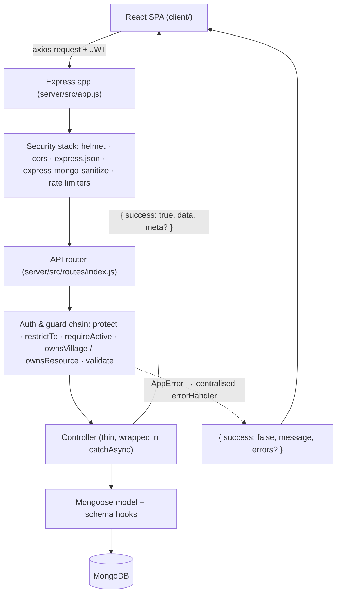
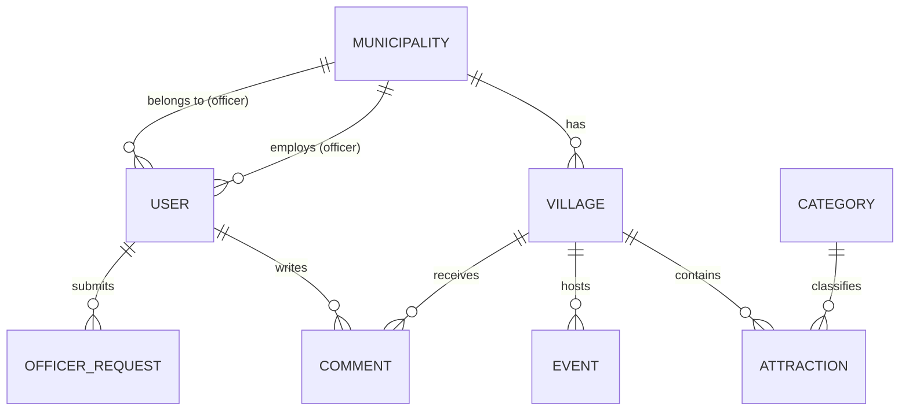

# Mountain-Able — Project Report
### A Digital Platform for Enhancing Tourism in Italian Mountain Villages

*Master's project work — Politecnico di Milano, Master "Mountain-Able" (supervisor: Prof. Corradi).*

This report documents the design and implementation of the Mountain-Able platform as it exists in the repository. Every capability, endpoint and constraint described here is derived from the source code (route definitions, middleware guards, Mongoose schemas and frontend route configuration). Where a feature was proposed but not implemented, this is stated explicitly rather than presented as complete.

---

## Table of contents

1. [Introduction](#1-introduction)
2. [Problem analysis](#2-problem-analysis)
3. [System overview](#3-system-overview)
4. [Actors and roles](#4-actors-and-roles)
   - 4.1 [Tourist](#41-tourist)
   - 4.2 [Municipality Officer](#42-municipality-officer)
   - 4.3 [System Administrator](#43-system-administrator)
   - 4.4 [Regional Authority](#44-regional-authority)
   - 4.5 [Actor–entity interaction matrix](#45-actorentity-interaction-matrix)
5. [System architecture](#5-system-architecture)
6. [Data model](#6-data-model)
7. [Security and access control](#7-security-and-access-control)
8. [Frontend implementation](#8-frontend-implementation)
9. [Testing and verification](#9-testing-and-verification)
10. [Current limitations and future work](#10-current-limitations-and-future-work)
11. [Ethical and sustainability considerations](#11-ethical-and-sustainability-considerations)

---

## 1. Introduction

Italy's tourism economy is heavily concentrated in a small number of well-known destinations. Cities such as Rome, Florence, Venice and Milan, together with a handful of coastal and lake resorts, absorb a disproportionate share of both domestic and international visitors. Beyond these hubs lies a vast and largely overlooked territory: the mountain villages of the Alps and the Apennines. These settlements hold centuries of cultural heritage, distinctive craft and food traditions, and landscapes of considerable natural value, yet they remain almost invisible in the channels through which most travellers plan their journeys.

The consequences of this imbalance are well documented and mutually reinforcing. Concentrated tourism produces congestion, rising living costs and cultural erosion in the major destinations, while the mountain interior suffers the opposite problem: economic marginalisation, ageing populations and progressive depopulation. As younger residents leave in search of opportunity, the local economy contracts, services close, and the villages become still harder to discover — a feedback loop that accelerates decline.

The Mountain-Able platform addresses one specific, tractable link in this chain: **visibility and trustworthy information**. It does not attempt to solve depopulation directly, nor does it replace the broader policy instruments that such a problem requires. Instead it provides the digital infrastructure that small municipalities lack — a single, maintained, searchable place where a mountain village can present itself, and where a traveller can find it.

The objectives of the project are therefore:

- to provide a **centralised repository** of tourism information for Italian mountain villages, maintained by the municipalities themselves;
- to make these villages **discoverable** through search, filtering and an interactive map;
- to build **trust** through community reviews, moderated for quality;
- to give regional authorities an **aggregated, evidence-based view** of tourism engagement across their territory; and
- to do all of this within a **clearly bounded scope**, avoiding features (booking, payments, transport) that would compromise the platform's neutrality or exceed the resources of a Master's project.

---

## 2. Problem analysis

Framed technically, the underlying problem is one of **data fragmentation and absent infrastructure**.

- **No centralised database exists.** Information about mountain villages is scattered across a heterogeneous collection of sources: individual municipal websites (often outdated and rarely mobile-friendly), downloadable PDF brochures, regional tourism portals with uneven coverage, and social-media pages maintained irregularly by volunteers or local associations.
- **Formats are inconsistent across municipalities.** Two neighbouring comuni may describe comparable attractions using entirely different structures, vocabularies and levels of detail. There is no shared schema, so the data cannot be aggregated, compared or searched uniformly.
- **Small administrations lack technical capacity.** A village of a few hundred residents does not employ web developers or content strategists. Where a website exists at all, it is frequently the product of a one-off contract that has since lapsed, leaving content frozen at the moment the contract ended.

The direct consequences follow from these conditions. Travellers cannot reliably find or compare mountain villages, so they default to the destinations that are already well served online. The absence of a feedback channel means municipalities receive no structured signal about what visitors value. Regional bodies, responsible for territorial development, have no consolidated dataset from which to reason about where tourism engagement is growing or lagging.

The resulting need is a **shared platform with a common data model, a low technical barrier to entry for municipalities, and a moderation layer that keeps the aggregated information trustworthy**. This is precisely the scope Mountain-Able implements: a common `Village` schema every municipality populates through the same interface; an officer role that requires no technical skill beyond filling in a web form; and an administrative role that validates content and moderates community contributions.

---

## 3. System overview

Mountain-Able is a full-stack web application composed of two deployable units held in one repository:

- a **REST API** (`server/`) built with Node.js, Express and MongoDB (via Mongoose), using JSON Web Tokens for authentication; and
- a **single-page frontend** (`client/`) built with React, Vite and Tailwind CSS.

The platform serves **four distinct user groups**, each modelled as a role on the `User` document (`server/src/models/User.js`, where `ROLES = ['tourist', 'officer', 'admin', 'authority']`):

- **Tourists** discover villages, search and filter them, read information, and contribute reviews and ratings.
- **Municipality Officers** create and maintain the villages, attractions and events belonging to their own municipality.
- **System Administrators** validate and publish content, moderate reviews, manage users, and approve officer accounts.
- **Regional Authorities** consume aggregated statistics about tourism engagement across the territory, in a strictly read-only capacity.

The **scope boundary** is a deliberate design decision. The following are explicitly **excluded** from the current system and documented as future work: online booking, payments, transport optimisation, real-time emergency services, and AI-based chatbots or recommendations. This exclusion is not an oversight; it keeps the platform a neutral information showcase rather than a commercial intermediary, and it keeps the engineering scope realistic for the project. Section 10 lists the excluded items again alongside the concrete gaps in the current build.

The core value chain the platform realises is: **officers produce content → administrators validate it → tourists consume it and generate feedback → authorities aggregate that feedback into territorial insight.** Section 4 develops this chain actor by actor.

---

## 4. Actors and roles

This section is the analytical core of the report. Each of the four roles is examined along eight dimensions: definition and purpose, position in the information flow, capabilities, restrictions, available screens, API surface, lifecycle, and a representative walkthrough. The capabilities and API tables are derived directly from the `restrictTo(...)` guards and the route definitions in `server/src/routes/`, not from recollection.

Two mechanisms recur throughout and are referenced repeatedly below:

- **`restrictTo(...roles)`** (`server/src/middleware/auth.js`) — a role guard that rejects the request with HTTP 403 unless the authenticated user holds one of the listed roles.
- **`requireActive`** (`server/src/middleware/auth.js`) — a guard that rejects any write for a user whose `status` is `pending`, used to implement the read-only mode for unapproved officers.

### 4.1 Tourist

#### a. Definition and purpose
The tourist is the end consumer of the platform and its most numerous actor. In the real world this is any traveller — domestic or international — interested in discovering Italian mountain villages beyond the conventional destinations. The system needs the tourist as a distinct role for two reasons: to gate the act of reviewing (only an authenticated, identifiable person may leave a rating, which protects the integrity of the ratings), and to separate the *consumption and feedback* concern cleanly from the *content production* concern that belongs to officers.

#### b. Position in the information flow
The tourist sits at the **consumption and feedback** end of the value chain. Tourists *consume* the content that officers produce and administrators publish — villages, attractions, events, images — and they *produce* one specific kind of data in return: reviews, each carrying a one-to-five star rating and free text. That feedback is the raw material that (after administrative moderation) feeds two downstream processes: the per-village rating aggregates displayed back to other tourists, and the territorial statistics consumed by authorities. The tourist therefore depends on officers (for content) and administrators (for moderation), and is depended upon by authorities (for the feedback signal).

#### c. Capabilities
Derived from the public routes and the `restrictTo('tourist')` guard on comment creation:

- Register a personal account (self-service).
- Authenticate, retrieve and update their own profile, including uploading an avatar image.
- Browse the published villages, with server-side search, region and minimum-rating filters, sorting and pagination.
- View a single village's full detail: description, gallery, municipality, attractions grouped by category, upcoming events and approved reviews.
- View the lightweight village map feed.
- Browse attractions and events (globally and per village), municipalities and categories.
- Create **one** review per village, with a 1–5 rating and text.
- Edit their own review **within 24 hours** of posting.
- Delete their own review at any time.

#### d. Restrictions
- A tourist **cannot create, edit or delete villages, attractions or events**. Attempting `POST /api/villages` returns HTTP 403 because the route is guarded by `restrictTo('officer', 'admin')`.
- A tourist **cannot moderate comments, manage users, municipalities or categories, or access any statistics** — every one of those routes carries an `admin`- or `authority`-only guard.
- The **one-review-per-village** rule is enforced at two layers: a compound unique index `{ userId: 1, villageId: 1 }` on the `Comment` collection (`server/src/models/Comment.js`) makes the database the source of truth, and the controller returns a friendly HTTP 409 on the second attempt.
- The **24-hour edit window** is enforced in `server/src/controllers/commentController.js`, which compares the comment's `createdAt` against the current time and rejects late edits with HTTP 403.

#### e. Screens available
All tourist screens live in the public frontend shell (`client/src/components/layout/Layout.jsx`):

| Route | Screen | Purpose |
|---|---|---|
| `/` | Home | Hero, most-popular villages, about, FAQ |
| `/villages` | Villages listing | Search/filter/sort grid + Leaflet map |
| `/villages/:slug` | Village detail | Full information + reviews section |
| `/events` | Events | Upcoming events across all villages |
| `/about` | About | Platform mission and scope |
| `/signup` | Sign up | Tourist self-registration |
| `/login` | Login | Opens the login modal over the home page |

The login and support dialogs are modal components rendered globally rather than dedicated routes.

#### f. API surface

| Method | Path | Purpose |
|---|---|---|
| `POST` | `/api/auth/register` | Self-register (role forced to `tourist`) |
| `POST` | `/api/auth/login` | Authenticate |
| `GET` | `/api/auth/me` | Read own profile |
| `PATCH` | `/api/auth/me` | Update own profile / upload avatar |
| `GET` | `/api/villages` | List/search/filter/paginate published villages |
| `GET` | `/api/villages/map` | Lightweight map feed |
| `GET` | `/api/villages/:slug` | Village detail |
| `GET` | `/api/villages/:villageId/attractions` | Attractions of a village |
| `GET` | `/api/villages/:villageId/events` | Events of a village |
| `GET` | `/api/villages/:villageId/comments` | Approved reviews of a village |
| `GET` | `/api/events` | Global events feed |
| `GET` | `/api/municipalities`, `/api/municipalities/:id` | Municipality info |
| `GET` | `/api/categories` | Category list |
| `POST` | `/api/villages/:villageId/comments` | Create a review (`restrictTo('tourist')`) |
| `PATCH` | `/api/comments/:id` | Edit own review (author, within 24h) |
| `DELETE` | `/api/comments/:id` | Delete own review (author or admin) |

#### g. Lifecycle
A tourist account comes into existence through **self-service registration** at `POST /api/auth/register`. The registration controller (`server/src/controllers/authController.js`) forces `role: 'tourist'` and `status: 'active'` regardless of the request body, so the public endpoint cannot be used to mint privileged accounts. The seed script also creates several tourist accounts for demonstration. A tourist account remains `active` unless an administrator suspends it (`PATCH /api/users/:id/status`), in which case authentication is refused; an administrator may also change its role or delete it.

#### h. Representative walkthrough — *discovering a village and leaving a review*
1. The tourist opens `/villages`. The frontend calls `GET /api/villages?sort=-rating&page=1&limit=8` and `GET /api/villages/map`; results render as a card grid alongside a Leaflet map.
2. They set the **Region** filter to *Abruzzo* and **Minimum rating** to *4+*. The filters are written to the URL query string, and a new `GET /api/villages?region=Abruzzo&minRating=4` request refreshes the grid.
3. They open *Scanno*. The frontend calls `GET /api/villages/scanno`, which returns the village with its populated municipality, attractions (with categories), upcoming events and the ten most recent approved reviews.
4. Not yet authenticated, they see a prompt to log in rather than a review form. They open the login modal and submit `POST /api/auth/login`.
5. The reviews section now shows a form. They select four stars, write a comment, and submit `POST /api/villages/{id}/comments`.
6. The `Comment` document is saved; its post-save hook recomputes the village's `ratingAverage` and `ratingCount`. The page refetches and the tourist sees their review listed and the average updated.

### 4.2 Municipality Officer

#### a. Definition and purpose
The officer is the **content producer**: an official representative of a specific comune, responsible for keeping that municipality's tourism information accurate and current. The system needs this role because content authority must be both *delegated* (a village should be maintained by the people who know it) and *bounded* (an officer of one municipality must not be able to alter another's data). The officer role, combined with the ownership middleware described below, encodes exactly this bounded delegation.

#### b. Position in the information flow
The officer is at the **production** end of the chain. Officers create the villages, attractions and events, and upload the images, that everyone else consumes. They depend on administrators in two ways: an administrator must **approve** the officer's account before it can write anything, and an administrator must **publish** a village before tourists can see it. Officers consume the feedback that tourists generate — the Feedback screen lets them read the reviews on their own villages — but they cannot moderate it; moderation is the administrator's responsibility. The officer therefore both feeds and is fed by the administrator, and produces the raw content that tourists ultimately consume.

#### c. Capabilities
Derived from the `restrictTo('officer', 'admin')` guards combined with the ownership middleware:

- Everything a tourist can do by way of browsing and profile management (officers are authenticated users on the same public API).
- Create a village. The controller (`server/src/controllers/villageController.js`) forces the new village's `municipalityId` to the officer's own municipality, so an officer cannot create content attributed to another comune.
- Update and delete villages **belonging to their own municipality**.
- Upload images to, and delete images from, their own villages (`POST`/`DELETE /api/villages/:id/images`).
- Create attractions and events under their own villages, and update or delete existing attractions and events that belong to their villages.

#### d. Restrictions
The officer's restrictions are the most intricate in the system and are worth describing precisely.

- **Municipality scoping on villages** is enforced by `ownsVillage` (`server/src/middleware/ownsVillage.js`). The middleware loads the target village, allows the request unconditionally if the caller is an admin, and otherwise permits it only when `req.user.role === 'officer'` **and** `village.municipalityId.equals(req.user.municipalityId)`. Any other case returns HTTP 403 with the message *"You can only manage villages of your own municipality."* This is the single place the rule lives, so no controller repeats it.
- **Municipality scoping on nested resources** (attractions and events, which are addressed by their own id rather than through a village) is enforced by `ownsResource(Model, name)` in the same file. It loads the attraction or event, resolves its parent village, and applies the identical admin-bypass / same-municipality check before allowing an update or delete.
- **Publishing is withheld from officers entirely.** `PATCH /api/villages/:id/publish` is guarded by `restrictTo('admin')`. An officer prepares content; only an administrator makes it publicly visible. The officer's village editor shows the publication status as read-only with an explanatory note, so the interface never offers an action that the API would reject.
- **The pending-officer read-only state.** A newly requested officer account is created with `status: 'pending'`. Such an account can authenticate and browse, but `requireActive` blocks every write route it might attempt, returning HTTP 403 with a message that the account is awaiting approval. The frontend reinforces this: the dashboard renders a persistent banner and disables every write control while the account is pending (`client/src/layouts/DashboardLayout.jsx` computes `readOnly = user.role === 'officer' && user.status === 'pending'` and exposes it through a context that the screens consult).

#### e. Screens available
The officer dashboard is mounted at `/dashboard` and guarded by `RequireRole roles={['officer']}` (`client/src/App.jsx`):

| Route | Screen | Purpose |
|---|---|---|
| `/dashboard` | Overview | Four KPI cards, "your villages", latest feedback |
| `/dashboard/villages` | My villages | Table of the officer's villages with row actions |
| `/dashboard/villages/new` | Village editor | Create a village |
| `/dashboard/villages/:id/edit` | Village editor | Tabbed editor: Details, Location, Media, Attractions, Events |
| `/dashboard/attractions` | Attractions | Manage attractions across the officer's villages |
| `/dashboard/events` | Events | Manage events across the officer's villages |
| `/dashboard/feedback` | Feedback | Read-only reviews on the officer's villages, with per-village distribution |
| `/dashboard/profile` | Profile | Shared profile screen |

#### f. API surface
In addition to the public read/auth endpoints listed for the tourist:

| Method | Path | Guard chain | Purpose |
|---|---|---|---|
| `POST` | `/api/villages` | `restrictTo('officer','admin')`, `requireActive` | Create a village (own municipality) |
| `PATCH` | `/api/villages/:id` | `+ ownsVillage` | Update own village |
| `DELETE` | `/api/villages/:id` | `+ ownsVillage` | Delete own village (cascades) |
| `POST` | `/api/villages/:id/images` | `+ ownsVillage`, `upload.array` | Upload images |
| `DELETE` | `/api/villages/:id/images/:idx` | `+ ownsVillage` | Remove an image |
| `POST` | `/api/villages/:villageId/attractions` | `+ ownsVillage` | Add an attraction |
| `PATCH` | `/api/attractions/:id` | `+ ownsResource` | Edit an attraction |
| `DELETE` | `/api/attractions/:id` | `+ ownsResource` | Delete an attraction |
| `POST` | `/api/villages/:villageId/events` | `+ ownsVillage` | Add an event |
| `PATCH` | `/api/events/:id` | `+ ownsResource` | Edit an event |
| `DELETE` | `/api/events/:id` | `+ ownsResource` | Delete an event |

#### g. Lifecycle
An officer account originates through the **public officer-request** endpoint `POST /api/users/officer-request`. This creates a `User` with `role: 'officer'` and `status: 'pending'`, links it to the named municipality (finding an existing municipality or creating a placeholder), and records an auditable `OfficerRequest` document that preserves the applicant's free-text message. The account is inert until an administrator reviews the request at `PATCH /api/officer-requests/:id`: approval sets the linked account to `active`, at which point `requireActive` stops blocking its writes; rejection sets it to `suspended`. The seed script additionally creates four already-active officers for demonstration. Thereafter an administrator may suspend, re-activate, re-role or delete the account through the user-management endpoints.

#### h. Representative walkthrough — *an approved officer publishes a new attraction*
1. The officer logs in and lands on `/dashboard`, whose Overview aggregates their villages, attractions, events and reviews.
2. They open **My villages** (`/dashboard/villages`) and click *Edit* on *Chamois*, arriving at `/dashboard/villages/{id}/edit`.
3. On the **Attractions** tab they click *Add attraction*, fill in a name and select a category, and submit `POST /api/villages/{id}/attractions`. `ownsVillage` confirms Chamois belongs to their municipality; the attraction is created.
4. They switch to the **Media** tab and drag two photographs onto the upload area, issuing `POST /api/villages/{id}/images`; they mark one as the cover.
5. The village's publication status is shown as *Draft* and read-only, with a note that an administrator must publish it.
6. Later, an administrator publishes the village (§4.3), and the new attraction becomes visible to tourists on the public detail page.

### 4.3 System Administrator

#### a. Definition and purpose
The administrator is the **custodian of quality and trust**. In the real world this is the platform operator — the team responsible for the correctness of published content, the health of the community, and the legitimacy of privileged accounts. The system needs a role with unrestricted reach because several essential functions have no natural owner elsewhere: deciding what becomes publicly visible, arbitrating community reviews, approving who may act as an officer, and maintaining the shared taxonomies (municipalities and categories) on which all other content depends.

#### b. Position in the information flow
The administrator is the **validation and governance** hub through which content and accounts pass on their way to legitimacy. Officers' content reaches tourists only after the administrator publishes it; would-be officers become able to act only after the administrator approves them; and tourists' reviews affect village ratings and territorial statistics only after the administrator has left them in (or moved them to) the `approved` state. Every other actor depends on the administrator, and the administrator depends on the officers and tourists whose work and contributions they curate.

#### c. Capabilities
The administrator is authorised for every guarded route in the system. `ownsVillage` and `ownsResource` grant admins an explicit bypass, so the municipality scoping that binds officers does not constrain administrators.

- Full create/read/update/delete over villages, attractions and events, for **any** municipality.
- **Publish or unpublish** any village (`PATCH /api/villages/:id/publish`).
- **Moderate reviews**: read the moderation queue of pending comments and set any comment's status to `approved` or `rejected`; delete any comment.
- **Manage users**: list and filter users, read a user, change a user's status (activate/suspend) or role, and delete a user.
- **Review officer requests**: list pending requests and approve or reject them, which also updates the linked account's status.
- **Manage municipalities**: full CRUD, with a guard that refuses deletion (HTTP 409) while villages still reference the municipality.
- **Manage categories**: full CRUD, with a guard that refuses deletion (HTTP 409) while attractions still reference the category.
- **Read all statistics** (the statistics routes admit both `authority` and `admin`).

#### d. Restrictions
The administrator faces no role-based restriction — the role is designed for full access. Two safeguards nonetheless apply. First, the delete-user endpoint (`server/src/controllers/userController.js`) refuses to let an administrator delete **their own** account (HTTP 400), and the frontend user table disables self-directed role, status and delete actions, to prevent an administrator from accidentally locking themselves out. Second, the referential-integrity guards on municipality and category deletion (HTTP 409) apply to administrators as much as anyone: the intent is that content cannot be orphaned even by a privileged actor.

#### e. Screens available
The administrator dashboard is mounted at `/admin` and guarded by `RequireRole roles={['admin']}`:

| Route | Screen | Purpose |
|---|---|---|
| `/admin` | Overview | Six KPI cards + pending-request and pending-moderation panels |
| `/admin/villages` | Villages | All villages incl. unpublished; publish toggle; bulk selection |
| `/admin/villages/new`, `/admin/villages/:id/edit` | Village editor | Full edit access (reuses the officer editor) |
| `/admin/municipalities` | Municipalities | CRUD with derived officer/village counts |
| `/admin/users` | Users | Role/status filters; change role, activate/suspend, delete |
| `/admin/officer-requests` | Officer requests | Approve/reject queue |
| `/admin/moderation` | Moderation | Pending-review queue with keyboard shortcuts |
| `/admin/categories` | Categories | CRUD with a lucide icon picker |
| `/admin/profile` | Profile | Shared profile screen |

#### f. API surface
In addition to all officer and public endpoints (unconstrained by ownership):

| Method | Path | Purpose |
|---|---|---|
| `PATCH` | `/api/villages/:id/publish` | Publish/unpublish a village |
| `GET` | `/api/comments/pending` | Moderation queue |
| `PATCH` | `/api/comments/:id/moderate` | Approve/reject a review |
| `DELETE` | `/api/comments/:id` | Delete any review |
| `GET` | `/api/users` | List/filter users |
| `GET` | `/api/users/:id` | Read a user |
| `PATCH` | `/api/users/:id/status` | Activate/suspend |
| `PATCH` | `/api/users/:id/role` | Change role |
| `DELETE` | `/api/users/:id` | Delete a user (not self) |
| `GET` | `/api/officer-requests` | List officer requests |
| `PATCH` | `/api/officer-requests/:id` | Approve/reject a request |
| `POST`/`PATCH`/`DELETE` | `/api/municipalities`, `/api/municipalities/:id` | Municipality CRUD |
| `POST`/`PATCH`/`DELETE` | `/api/categories`, `/api/categories/:id` | Category CRUD |
| `GET` | `/api/stats/*` | All statistics |

#### g. Lifecycle
There is no self-service path to an administrator account. In the current build administrators are **seeded** (`server/src/seed/seed.js` creates one admin) or promoted by an existing administrator via `PATCH /api/users/:id/role`. This is a deliberate consequence of the design: because the registration endpoint hard-codes the tourist role, privilege can only ever be conferred by another privileged actor or by the seed, never claimed.

#### h. Representative walkthrough — *approving an officer and publishing their work*
1. The administrator opens `/admin`. The Overview panel shows a badge with the number of pending officer requests, sourced from `GET /api/officer-requests?status=pending`.
2. They open **Officer requests** (`/admin/officer-requests`) and read a card showing the applicant, the requested municipality, the region and the free-text message.
3. They click *Approve*, confirm the municipality details in the modal, and submit `PATCH /api/officer-requests/{id}` with `{ status: 'approved' }`. The request is marked approved, and the linked officer account moves to `active`.
4. The newly active officer (§4.2) creates a village and prepares its content, which remains in draft.
5. The administrator opens **Villages** (`/admin/villages`), finds the draft, and clicks its status toggle, issuing `PATCH /api/villages/{id}/publish` with `{ isPublished: true }`.
6. The village is now visible to tourists on the public listing and map.

### 4.4 Regional Authority

#### a. Definition and purpose
The regional authority is the **strategic observer**: a public body responsible for territorial development that needs evidence about tourism engagement but has no operational role in producing or moderating content. The system needs this role precisely so that such evidence can be exposed *without* granting any write capability — the authority must be able to see the aggregate without being able to alter the particulars.

#### b. Position in the information flow
The authority is at the **aggregation and insight** end of the chain, downstream of everyone. It consumes the statistics computed from the content officers produce and the feedback tourists generate (as validated by administrators), and it contributes nothing back into the data. Its dependency is total and one-directional: it relies on the entire upstream chain functioning, and no other actor depends on it.

#### c. Capabilities
Derived from the `restrictTo('authority', 'admin')` guard on the statistics router:

- Everything a tourist can do by way of public browsing and profile management.
- Read the four aggregated statistics endpoints:
  - `GET /api/stats/overview` — platform-wide totals and the mean rating;
  - `GET /api/stats/regions` — per-region village counts, mean ratings, review totals and attraction totals;
  - `GET /api/stats/villages/top` — the top villages by rating subject to a minimum review threshold;
  - `GET /api/stats/satisfaction` — the 1–5 rating distribution and a twelve-month time series of review volume and mean rating.

All four are implemented as MongoDB aggregation pipelines (`server/src/controllers/statsController.js`) rather than in-memory reductions.

#### d. Restrictions
The authority is **read-only throughout**. It holds no write capability anywhere in the system: it is absent from every `restrictTo` list except the statistics router (and the implicitly public read routes). There is no municipality scoping to apply because there is nothing for the authority to own; the restriction is simply the absence of any granted mutation. The frontend enforces the same posture — the authority dashboard contains no create, edit or delete control of any kind.

#### e. Screens available
The authority dashboard is mounted at `/authority` and guarded by `RequireRole roles={['authority']}`:

| Route | Screen | Purpose |
|---|---|---|
| `/authority` | Overview | KPI cards, villages-per-region bar chart, review-volume line chart |
| `/authority/regions` | Regions | Sortable table + horizontal bar chart of mean ratings; CSV export |
| `/authority/top-villages` | Top villages | Ranked list with optional region filter; CSV export |
| `/authority/satisfaction` | Satisfaction | Distribution bar chart, dual-axis monthly trend, regional comparison; CSV export |
| `/authority/profile` | Profile | Shared profile screen |

Charts are rendered with Recharts, and each table offers a client-side CSV export.

#### f. API surface

| Method | Path | Purpose |
|---|---|---|
| `GET` | `/api/stats/overview` | Platform totals + mean rating |
| `GET` | `/api/stats/regions` | Per-region aggregates |
| `GET` | `/api/stats/villages/top` | Top villages (min. review threshold) |
| `GET` | `/api/stats/satisfaction` | Rating distribution + 12-month trend |

together with the public read endpoints and `/api/auth/*` for the session.

#### g. Lifecycle
Like the administrator, the authority account has **no self-service path**. It is seeded (the seed script creates one authority account) or assigned by an administrator via `PATCH /api/users/:id/role`. Its state can subsequently be changed only by an administrator.

#### h. Representative walkthrough — *comparing regional engagement and exporting the figures*
1. The authority logs in and lands on `/authority`, whose Overview issues `GET /api/stats/overview`, `GET /api/stats/regions` and `GET /api/stats/satisfaction` and renders the KPI cards and charts.
2. They open **Regions** (`/authority/regions`), backed by `GET /api/stats/regions`, and sort the table by mean rating to see which regions score highest.
3. They read the horizontal bar chart comparing mean ratings across regions.
4. They click **Export CSV**; the current table is serialised client-side and downloaded, for inclusion in an internal territorial report.
5. They move to **Satisfaction** (`/authority/satisfaction`) and read the twelve-month trend of review volume against mean rating to judge whether engagement is growing.

### 4.5 Actor–entity interaction matrix

The following matrix summarises the create/read/update/delete permissions of each actor against the core entities, as enforced by the route guards and ownership middleware. **C** = create, **R** = read, **U** = update, **D** = delete. A parenthetical qualifies the scope.

| Entity | Tourist | Officer | Administrator | Authority |
|---|---|---|---|---|
| **Village** | R (published) | C·R·U·D (own municipality); no publish | C·R·U·D (all) + publish | R |
| **Attraction** | R | C·R·U·D (own villages) | C·R·U·D (all) | R |
| **Event** | R | C·R·U·D (own villages) | C·R·U·D (all) | R |
| **Comment** | C (one/village)·R·U (own, <24h)·D (own) | R | R·U (moderate)·D (any) | R |
| **Municipality** | R | R | C·R·U·D (409 if villages exist) | R |
| **Category** | R | R | C·R·U·D (409 if attractions exist) | R |
| **User** | R·U (own profile) | R·U (own profile) | R·U·D (all, not self) | R·U (own profile) |
| **OfficerRequest** | C (public form) | — | R·U (approve/reject) | — |

Notes: "R (published)" for the tourist reflects that public village listings return only `isPublished: true` documents, whereas administrators and the owning officer may request unpublished ones via `includeUnpublished=true`. Comment **U** for the administrator is a moderation status change rather than an edit of the text. "User C" is intentionally omitted for every actor because there is no general user-creation endpoint: tourists arise from public registration, officers from the request flow, and administrators/authorities from seeding or promotion.

---

## 5. System architecture

The system follows a conventional **three-layer architecture** — presentation, application and data — with a clean separation between a stateless REST API and a single-page client.

- **Presentation layer.** The React SPA in `client/` renders all user interfaces and holds no business rules of its own; it calls the API through a single configured axios instance (`client/src/lib/api.js`).
- **Application layer.** The Express application in `server/src/` receives requests, runs them through a middleware chain, dispatches to thin controllers, and returns a consistent JSON envelope. Controllers hold orchestration only; reusable logic lives in `server/src/utils/` and in model statics.
- **Data layer.** MongoDB, accessed through Mongoose models in `server/src/models/`, persists the data and — importantly — hosts the rating-aggregation logic in schema hooks (§6).

The **request lifecycle** is illustrated below.

The **middleware chain** is the backbone of the application layer. A mutating request typically traverses, in order: the global security middleware (`server/src/app.js`); the feature router; `protect` (authenticate and attach `req.user`); `restrictTo(...)` (role check); `requireActive` (block pending officers on writes); `ownsVillage` or `ownsResource` (municipality scoping); a validator chain followed by `validate` (input checking); and finally the controller. Any failure at any stage throws an `AppError`, which the wrapper `catchAsync` (`server/src/utils/catchAsync.js`) forwards to the centralised error handler (`server/src/middleware/errorHandler.js`) — so no controller contains a `try/catch`.

The **response envelope** is uniform. Successful responses take the shape `{ success: true, data, meta? }`, where `meta` carries pagination information (`{ total, page, limit, totalPages }`); error responses take the shape `{ success: false, message, errors? }`, where `errors` is a field-keyed object for validation failures. The helpers in `server/src/utils/apiResponse.js` and the error handler enforce this convention, and the frontend depends on it throughout.

---

## 6. Data model

The database comprises eight collections. The tables below give each collection's fields, types and salient constraints as declared in `server/src/models/`.

**User** (`User.js`)

| Field | Type | Constraints |
|---|---|---|
| firstName, lastName | String | required |
| email | String | required, unique, lowercase, indexed |
| password | String | required, min 6, `select: false` (hashed with bcryptjs) |
| role | String | enum `tourist`/`officer`/`admin`/`authority`, default `tourist`, indexed |
| municipalityId | ObjectId → Municipality | required only when `role === 'officer'` |
| avatar, phone, city | String | optional |
| status | String | enum `pending`/`active`/`suspended`, default `active` |
| createdAt, updatedAt | Date | timestamps |

**Municipality** (`Municipality.js`): `name` (indexed), `region` (indexed), `province` — all required; `contactEmail`, `phone` optional.

**Village** (`Village.js`)

| Field | Type | Constraints |
|---|---|---|
| name | String | required, indexed |
| slug | String | required, unique, lowercase, indexed |
| description | String | required |
| shortDescription | String | optional |
| region, province | String | required (region indexed) |
| location | `{ lat, lng }` | required |
| altitude, population | Number | optional |
| images | [String] | default `[]` |
| coverImage | String | optional |
| municipalityId | ObjectId → Municipality | required, indexed |
| ratingAverage | Number | default 0, indexed (maintained automatically) |
| ratingCount | Number | default 0 (maintained automatically) |
| stats | `{ hotels, shops }` | numeric sub-document |
| isPublished | Boolean | default `false`, indexed |

**Category** (`Category.js`): `name` (required), `slug` (required, unique, indexed), `icon` (a lucide-react icon name).

**Attraction** (`Attraction.js`): `name` (required), `description`, `categoryId → Category` (required, indexed), `villageId → Village` (required, indexed), `images`, `location`.

**Event** (`Event.js`): `title` (required), `description`, `startDate` (required, indexed), `endDate` (required), `villageId → Village` (required, indexed), `image`. The controller and validators additionally enforce `endDate ≥ startDate`.

**Comment** (`Comment.js`): `content` (required), `rating` (Number, required, `min: 1`, `max: 5`), `userId → User` (required, indexed), `villageId → Village` (required, indexed), `status` (enum `pending`/`approved`/`rejected`, default `approved`, indexed). A **compound unique index** `{ userId: 1, villageId: 1 }` enforces one review per user per village.

**OfficerRequest** (`OfficerRequest.js`): `requesterName`, `email` (indexed), `municipalityName`, `region` (all required), `province`, `message`, `status` (enum, default `pending`), `reviewedBy → User`, `reviewedAt`.

The relationships are shown below.

### 6.1 Automatic rating aggregation

The denormalised fields `Village.ratingAverage` and `Village.ratingCount` are never computed in a controller. They are maintained by a static method, `Comment.recalculateRatings(villageId)`, invoked from Mongoose post-hooks declared in `server/src/models/Comment.js`. The method runs an aggregation over the comments of a village, **filtered to `status: 'approved'`**, and writes the resulting count and mean back onto the village document.

Three hooks cover every write path, which matters because Mongoose document middleware and query middleware behave differently:

- `post('save')` — fires when a new review is created or a document is saved;
- `post('findOneAndUpdate')` — fires on moderation and edits (e.g. `findByIdAndUpdate`);
- `post('findOneAndDelete')` — fires on deletion (e.g. `findByIdAndDelete`).

Each hook **returns** the recalculation promise so that Mongoose awaits it before the operation resolves, which avoids a race in which the write completes before the aggregate is refreshed.

Placing this logic in the model rather than a controller has two justifications. First, **correctness through single-sourcing**: because every mutation path funnels through the same hooks, the aggregate cannot drift no matter which controller (or the seed script) performs the write. Second, **the approved-only rule is a data invariant, not a presentation choice**: a village's public rating must reflect only reviews an administrator has allowed to stand, and encoding that in the model guarantees it holds for any consumer of the data. The seed script, which bypasses document hooks by using `insertMany`, calls the static explicitly after inserting comments, precisely to honour the same invariant.

---

## 7. Security and access control

Security is layered, with each layer defending against a distinct class of threat. The layers are assembled in `server/src/app.js` and the route middleware.

**Authentication.** Passwords are hashed with **bcryptjs** at cost factor 12 in a `pre('save')` hook (`server/src/models/User.js`) and are excluded from queries by `select: false`, so a hash is never returned even accidentally. Sessions use **JSON Web Tokens**: `signToken` (`server/src/utils/jwt.js`) issues a token whose lifetime is governed by `JWT_EXPIRES_IN` (default `7d`), and `protect` (`server/src/middleware/auth.js`) verifies the `Authorization: Bearer` token on each protected request, loads the user, rejects suspended accounts, and attaches `req.user`. This defends against credential theft (hashes are non-reversible and salted) and against forged or expired sessions (tokens are signed and time-limited).

**Authorisation.** Above authentication sits the role and ownership chain. `restrictTo(...roles)` enforces coarse role boundaries; `requireActive` enforces the pending-officer read-only state; and `ownsVillage` / `ownsResource` (`server/src/middleware/ownsVillage.js`) enforce fine-grained municipality ownership so that an officer cannot touch another comune's data. Together these defend against privilege escalation and against horizontal access between peers of the same role.

**Input validation.** Every write endpoint carries an `express-validator` chain (in `server/src/middleware/validators/`) followed by `validate` (`server/src/middleware/validate.js`), which rejects malformed input with HTTP 422 and a field-keyed `errors` object. This defends against malformed and out-of-range data reaching the models (for example, a rating outside 1–5, or an event whose end precedes its start).

**NoSQL injection sanitisation.** `express-mongo-sanitize` strips keys containing `$` or `.` from request payloads before they reach any query, defending against operator-injection attacks that would otherwise let a crafted body alter query semantics (for instance submitting `{ "$gt": "" }` where a scalar is expected).

**Rate limiting.** Two `express-rate-limit` limiters (`server/src/middleware/rateLimit.js`) apply per IP: a general limiter of 100 requests per 15 minutes across `/api`, and a stricter limiter of 20 requests per 15 minutes on `/api/auth`. These defend against brute-force credential attacks and against casual denial-of-service through request flooding. (The limiters are disabled under `NODE_ENV=test` to allow scripted verification.)

**Transport and header hardening.** `helmet` sets a conservative set of security headers (including a content-security policy), configured with a cross-origin resource policy so that images served from `/uploads` can be embedded by the separate frontend origin. `cors` restricts the accepted origin to the configured client.

**Upload restrictions.** The multer configuration (`server/src/middleware/upload.js`) accepts only the image MIME types `image/jpeg`, `image/jpg`, `image/png` and `image/webp`, rejects anything else with HTTP 400, caps file size at 5 MB, and writes files under `uploads/` with collision-free generated names. This defends against the upload of executable or oversized content and against filename-collision overwrites.

**Consistent error surfacing.** The centralised error handler maps known failure modes to appropriate status codes — Mongoose validation to 422, duplicate keys to 409, cast errors and multer errors to 400 — and never leaks stack traces outside development. This prevents information disclosure through error messages.

---

## 8. Frontend implementation

**Design system.** The visual language derives from an existing Figma prototype and is codified in `client/tailwind.config.js`: the brand palette (`primary #21bf73`, `cta #25d366`, `ink #2b2b2b`, `cream #faf7f2`), the Inter type family, a consolidated type scale (`display`, `h1`, `h2`, `h3`, `body-lg`, `body`, `small`), and the radius, shadow and spacing tokens. The consolidation of the type scale — the Figma used several near-duplicate sizes — was itself a deliberate correction, described among the deviations below.

**Component architecture.** The interface is built from a library of presentational primitives in `client/src/components/ui/` (Button, Input, Select, Rating, Card, Badge, Modal, DataTable, StatCard, Pagination, Skeleton, EmptyState, ErrorState and others), composed by feature components (village cards, the reviews section, the search bar, the maps) and by page components under `client/src/pages/`. The dashboards share a single chrome, `client/src/layouts/DashboardLayout.jsx`, driven by a per-role configuration object (`client/src/config/dashboardNav.js`) rather than three duplicated layouts. Tables across all dashboards are the single `DataTable` implementation, extended to support server-side pagination, URL-reflected sorting, selection, loading skeletons, empty and error states, and a responsive stacked-card mode.

**Routing and route guards.** Routing uses `react-router-dom` (`client/src/App.jsx`). Public pages sit under a shared `Layout`; the three dashboards sit under their own `DashboardLayout` and are each wrapped in `RequireRole roles={[...]}` (`client/src/components/RequireRole.jsx`). The guard sends unauthenticated users to `/login` with a `redirect` parameter, shows a 403 page for the wrong role (rather than a silent redirect), and — following a fix documented in the repository — shows a retryable connection screen rather than logging the user out when the session cannot be hydrated because the server is unreachable.

**Internationalisation.** All user-facing text is routed through `t()` (i18next), with English and Italian resource files in `client/src/locales/en.json` and `it.json`. Both locales are maintained in parallel; no string is hard-coded in a component.

**State handling.** Cross-cutting state lives in a small set of React contexts: authentication (`AuthContext`), global modals (`ModalContext`), toasts (`ToastContext`) and the dashboard read-only flag (`DashboardContext`). Data fetching is centralised in a `useFetch` hook that returns `{ data, meta, loading, error, refetch }`, so pages never call axios inline and every view obtains the same lifecycle handling.

**The four-state pattern.** Every list and detail view handles four states explicitly: **loading** (skeletons, never a bare spinner on a full page), **empty** (a friendly empty-state with a relevant action), **error** (a retryable `ErrorState` that distinguishes a connection failure from a server error), and **success**. Mutations surface success and failure through toast notifications.

**Documented deviations from the Figma prototype.** The prototype was treated as a working draft, and several elements were corrected with justification:

| Deviation | Justification |
|---|---|
| Hero headline reduced from three competing colours to two (ink + brand green) | The original palette fought itself; two tones read as intentional emphasis. |
| Type scale consolidated to seven tokens | The prototype's near-duplicate sizes were arbitrary; a fixed scale is consistent and maintainable. |
| Booking-style search bar (Location/Date/Guests) rebuilt as Name/Region/Minimum-rating | The platform has no booking; the original fields were a template leftover with no meaning here. |
| Village card given a rating/review-count/region row and tightened | Ratings are central to the product yet the prototype card omitted them. |
| Village-detail stats strip changed from "Tourists/Hotels/Shops" to Attractions/Events/Reviews | The system measures none of the original figures; displaying invented numbers would be dishonest. |
| Reviews section designed from scratch | The prototype omitted the review feature entirely, though it is central to the product. |
| Profile stat cards changed from "15 Personnel" to real role-specific metrics | The originals were placeholders from an unrelated template. |
| "Date of birth" removed from the profile | Not collected, not on the model, and unjustifiable under data minimisation (see §11). |
| French labels routed through `t()` | The rest of the product is English/Italian; the stray French was inconsistent. |
| Retail sidebar (Stocks/Staff/Finance) replaced with tourism navigation | The original items belonged to an unrelated template. |

---

## 9. Testing and verification

Verification of this project was **manual and scripted, not a formal automated test suite**, and it is described here without overstatement.

On the backend, correctness was checked through **manual API testing**. The repository includes `server/test-api.http`, a REST-Client collection with a working request for every endpoint, exercised against a live server seeded with the demonstration dataset. During development, targeted Node scripts were used to confirm specific invariants — most importantly that the rating aggregates recompute correctly on comment creation, moderation and deletion, and that the aggregate stored on each village matches an independent aggregation over its approved comments. Role and ownership behaviour (for example that an officer receives HTTP 403 when acting on another municipality's village, and that a pending officer is blocked from writes) was verified through sequences of authenticated requests.

On the frontend, verification used **scripted browser checks** driven through a headless Chrome instance. These confirmed that every public and dashboard screen renders without console errors across all four roles; that the wrong-role guard shows a 403 page; that no untranslated i18n keys leak into the rendered output; that representative mutations (creating and deleting an attraction, for instance) complete and reflect in the interface; that the pending-officer read-only banner appears and write controls are disabled; that there is no horizontal overflow at a 375-pixel viewport; and that the session-preservation behaviour under a simulated server outage is correct. The browser-automation dependency used for these checks was installed temporarily and removed afterwards; it is not part of the committed project.

No unit-test or integration-test framework (such as Jest or Vitest) is configured in the repository, and there is no continuous-integration pipeline. The verification described above is repeatable but manual in initiation. This is a known limitation and is restated in §10.

---

## 10. Current limitations and future work

### 10.1 Known gaps in the current build

- **No password-change endpoint.** `PATCH /api/auth/me` does not accept a password field, so the Profile screen's "Password & Security" form is present but not wired to a working endpoint; submitting it shows an informational notice.
- **No self-service account deletion.** `DELETE /api/users/:id` is administrator-only and refuses self-deletion, so the Profile "Delete account" control confirms intent but then explains that deletion must be requested from an administrator rather than performing it.
- **No review-reporting endpoint.** The officer Feedback screen's "Report to admin" action is a client-side acknowledgement only; there is no server-side mechanism to record or route such a report.
- **The top-villages statistic omits the municipality.** `GET /api/stats/villages/top` returns region and province but not the municipality name, so the authority's Top Villages screen shows region/province instead.
- **No per-officer aggregate endpoint.** The officer Overview and Profile compose their figures client-side from the village, attraction, event and comment endpoints, producing a small request fan-out rather than reading a single tailored statistic.
- **Officer-request approval cannot edit the municipality inline.** The approval flow confirms the submitted details but cannot amend the linked municipality within the same action, because the request record does not carry the municipality's identifier.
- **Unsaved-changes protection is browser-level.** The village editor warns on browser unload via `beforeunload`, but does not block in-app navigation, because the router configuration in use does not expose a navigation blocker.
- **No automated test suite or CI**, as described in §9.
- **Deployment is local.** Uploaded images are stored on the local filesystem under `uploads/`, which is appropriate for development but would require object storage in production.

### 10.2 Planned extensions (future work)

The following were part of the original proposal and are deliberately excluded from the current scope:

- an **AI chatbot** to answer visitor questions in natural language;
- **sentiment analysis** over review text to complement the numeric ratings;
- **tourism-trend prediction** from the accumulating engagement data;
- **online booking, payments and transport optimisation**, and integration with **emergency services** — the commercial and operational features intentionally left out to keep the platform a neutral information showcase;
- a **wider geographical scope**, extending the model beyond Italian mountain villages to comparable underrepresented regions elsewhere.

Each of these builds on, rather than contradicts, the current data model: the reviews already captured are the substrate for sentiment analysis, and the engagement time series is the substrate for trend prediction.

---

## 11. Ethical and sustainability considerations

The platform's purpose — directing visitors toward marginalised communities — carries ethical weight, and several design decisions reflect it directly.

**Over-tourism and sustainability.** The platform is intended to *distribute* tourism more evenly, not to concentrate it. By surfacing many small villages rather than promoting a few, it works against the congestion dynamic that damages both the honeypot destinations and, potentially, any village that became a sudden sensation. The deliberate exclusion of booking and payment features reinforces this: the platform informs and connects but does not industrialise access, leaving the pace of visitation in the hands of the communities themselves.

**Cultural respect.** The content model places authorship with the municipalities. Officers describe their own villages in their own terms; the platform provides structure without imposing a homogenised narrative. This keeps the representation of each community in the hands of its own representatives.

**Content moderation.** Community reviews are valuable but can be abused. The moderation workflow — the `pending`/`approved`/`rejected` status on every comment, the administrator moderation queue, and the invariant that only approved reviews affect a village's public rating — exists to keep the aggregate trustworthy without silencing genuine feedback. Ratings shown to the public and fed to authorities therefore reflect content that has survived human review.

**Data privacy and data minimisation.** The system collects only what it needs, and two concrete decisions illustrate the principle. First, **date of birth is not collected**: it appeared in the Figma prototype's profile screen, but it is not on the `User` model, serves no function in this system, and would be personal data gathered without purpose — so it was removed, and the profile field was replaced with the user's municipality or role. Second, the village-detail page **does not display visitor, hotel or shop counts** that the prototype showed, because the system has no way to measure them; presenting invented figures would be both dishonest and, in the case of purported visitor tracking, an implied data practice the platform does not actually perform. The stats strip instead shows quantities the database genuinely holds — attractions, upcoming events and reviews. Passwords are stored only as bcrypt hashes and are never returned by the API, and the authentication token is time-limited.

Taken together, these choices treat the villages as the platform's primary stakeholders and hold the implementation to the standard of only claiming, collecting and displaying what it can honestly support.
